# Demo 1.2: New Platform on Shared Business Logic

This demo should take about 10 minutes.

## Objectives

The goal here is to show how we can use Xamarin Native to extend an existing app, build for UWP, to the Android platform. We’ll do code share all the business logic between the UWP and Android clients.

## Requirements

-   Hyper-V enabled PC. Required for the Visual Studio UWP and Visual Studio Android emulators.

-   Internet connection to setup and run the demos.

-   Visual Studio 2015 or Community edition with Update 3 - Visual Studio 2015 Community edition is at [https://www.visualstudio.com/vs/mobile-app-development/](https://www.visualstudio.com/vs/mobile-app-development/%20)

-   Visual Studio Android emulator: <https://www.visualstudio.com/vs/msft-android-emulator/>

-   (Optional) Mac for compiling and running the iOS projects. Mac is also required to use the XCode designers within Visual Studio for PC or Mac.

If you encounter issues with connecting Visual Studio debugger with the Visual Studio I would recommend following the steps from this blog article: <http://dotnetbyexample.blogspot.ca/2016/02/fix-for-could-not-connect-to-debugger.html>

## 

## Setup

Make sure Hyper-V is running.

### Cognitive Services

You need to register with Cognitive Services APIs at: <https://www.microsoft.com/cognitive-services>.

Registration is free so no API service costs will be incurred.

> 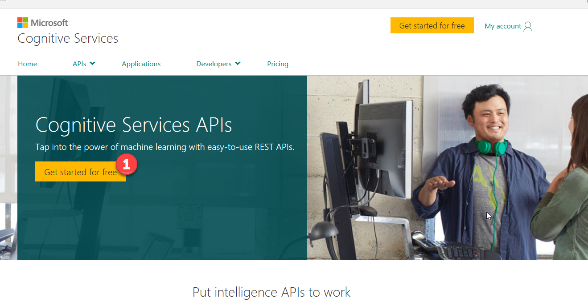

1.  Once you have registered and verified your account, log into your Cognitive Services account where you should see a list of the available APIs.

2.  Locate the Bing Search - Free service. Select it and agree to the Microsoft Cognitive Services Terms (1) and then click Subscribe (2).

> 

1.  Copy the Key 1 value from Bing Search Free Api. We are going to use this for the demo.

> 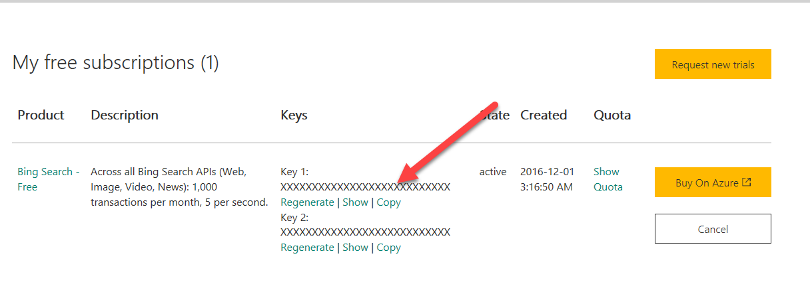

1.  Go to the Solutions folder that comes with this Session’s content, locate the Demo 1.2.zip file, extract it to a new folder under your Documents folder and locate the solution (.SLN) file under the *Start* folder.

2.  To complete the setup, you can test your setup (especially the Android emulator) by opening the solution under the *Complete* folder in Visual Studio 2015 and trying to run the Android version of the application in the Hyper-V-based emulator, noting that the image search API will not be hooked up.

3.  Locate the ServiceKeys.cs file (1) in the ImageSearch (Portable) project. Locate the BingSearch variable and replace the value with the key your copied from the Bing Search API.\
    \
    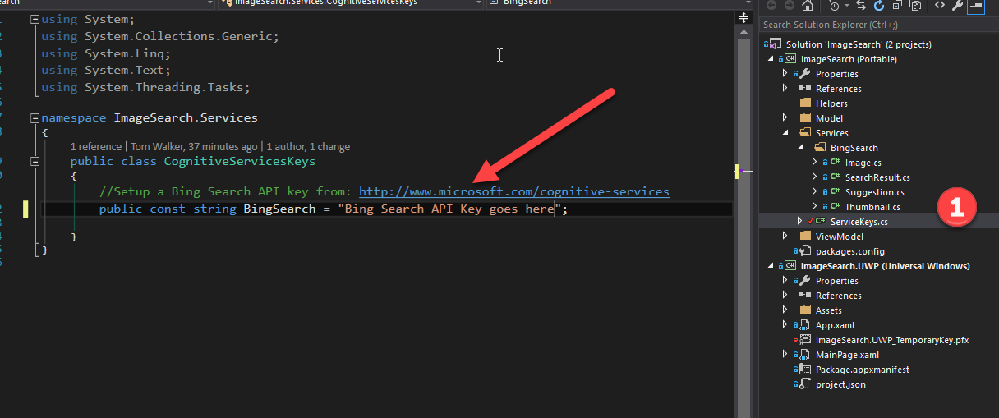

## Demo Steps

1.  Open up the extracted solution under the *Start* folder for demo 1.2 in Visual Studio 2015

2.  Explain that we are starting with an existing Windows 10 UWP application using 2 projects. One is the main UI using XAML & C\# and the other is a C\# Portable Class Library with view models, models and services. Many UWP XAML applications are built with these kinds of classes. Expand the Model, Services & ViewModel folders and provide an overview of what these do.

3.  With “ImageSearch.UWP” as the startup project, press F5 to run the UWP client. Enter Xbox and click on the Search button. We should get back image results verifying that setup is correct.

    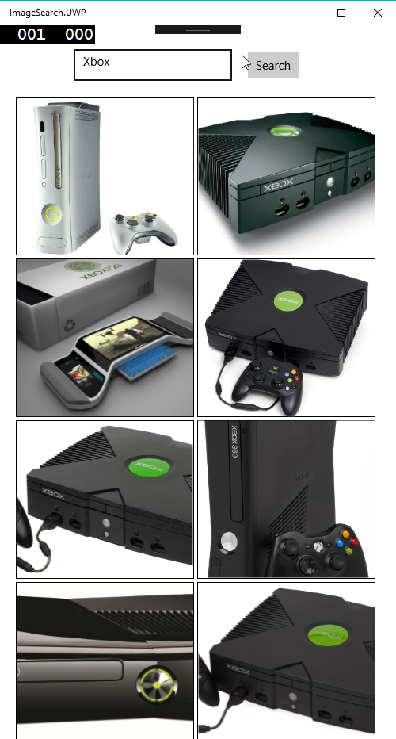

4.  Now we are going to expand the userbase of the application for use on Android devices. We need to add a new project. Locate the Android (1) project templates under Visual C\# group and select Blank App (Android) (2). Name the project ImageSearch.Droid (3) and click OK (4).

> 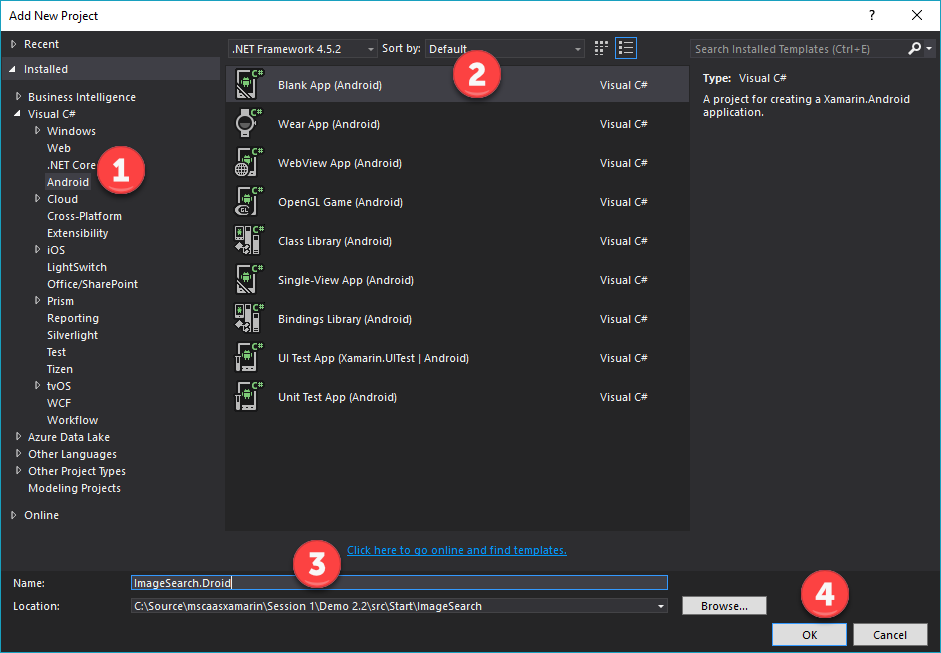

1.  We will be adding in the same shared C\# Portable Class Library business core as used by the UWP client project. Right click to bring up the menu and selected Add Reference (1). Explain how we are leveraging the existing work done for the UWP project.

> 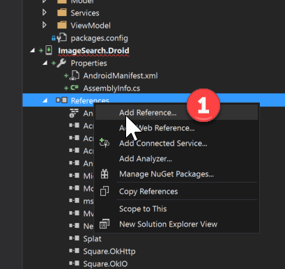

1.  Add the reference to the ImageSearch project and then click the OK button (1).

> 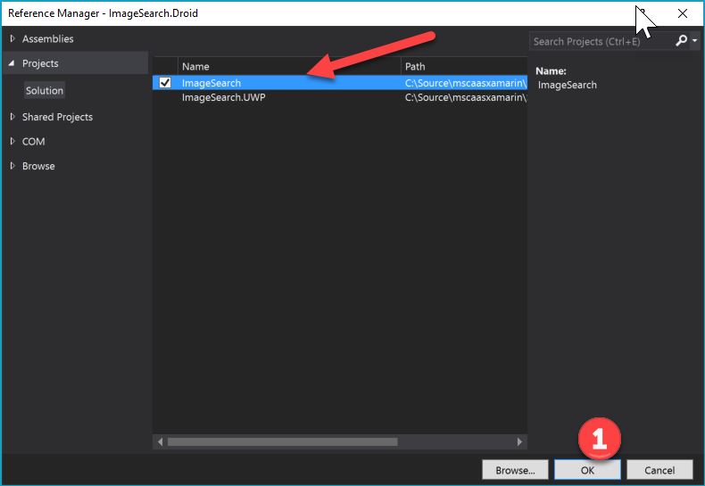

1.  Next, we need to install the following Nuget packages to ImageSearch.Droid project. We will repeat the steps for adding each Nuget package. Select the Android project. Then right click to bring up the menu and select Manage Nuget Packages (1).

> 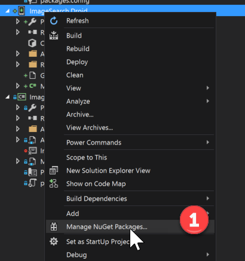

1.  Under the Browse tab (1), enter the name of the first package in the list - “Acr.UserDialogs”. Select the correct package name (2) and then click the install button (3). Follow the prompts to complete the installation. You will perform this same steps for each of the following packages. Try to explain what each one does.

> **Acr.UserDialogs** –
>
> A cross platform library that allows you to call for standard user dialogs from a shared/portable library. Supports Android, iOS, and Unified Windows Platform (UWP, UAP)
>
> **Newtonsoft.Json** -
>
> allows for serialize and deserialize of data into JSON
>
> **Refractored.MvvmHelpers – **
>
> a collection of Mvvm helper classes.
>
> **Square.Picasso - **
>
> A powerful image downloading and caching library for Android
>
> **Xamarin.Android.Support.v7.CardView –** provides the Android 5.0 (Lollipop) CardView widget.
>
> 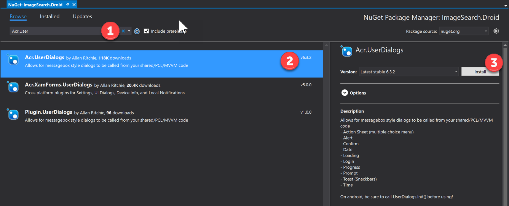

1.  Next, explain the general purpose of the MainActivity.cs file, then delete the MainActivity.cs file from the ImageSearch.Droid project (1). To speed up the demo time we will be adding existing replacement code files into the project.

> 

1.  For this step, we will be adding in the code files into the root of the ImageSearch.Droid project. Select the ImageSearch.Droid project. Right-click to bring up the menu (1). Select Add (2), then select Existing item (3).

> 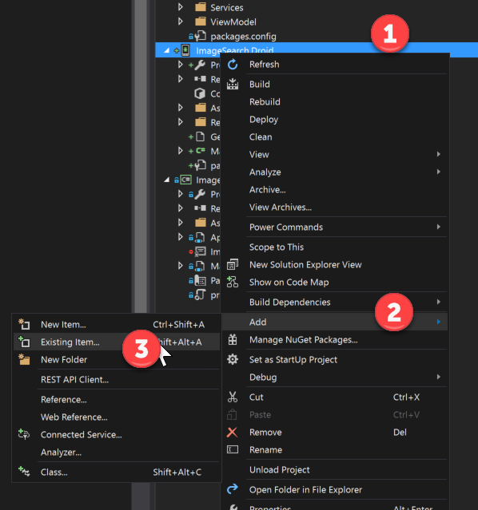

1.  Locate the subfolder “code files”. We need to add in the following files: BaseActivity.cs, MainActivity.cs and SquareImageView.cs.

> 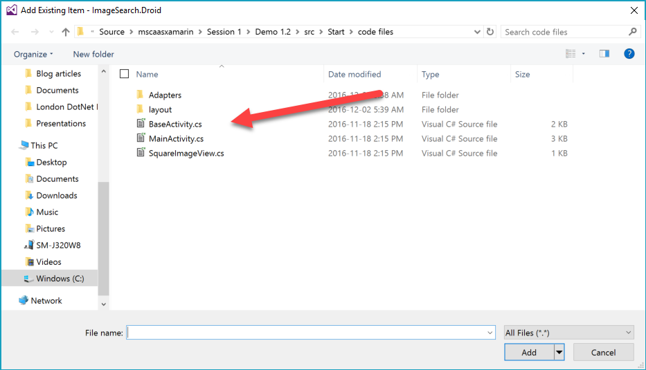

1.  Upon up the new files, especially MainActivity.cs to briefly explain what this now does.

2.  We need to create a new folder called Adapters within the ImageSearch.Droid project. Select the ImageSearch.Droid project. Right-click to bring up the menu (1), then select the Add menu option (2) followed by New Folder (3). Name the new folder Adapters.

> 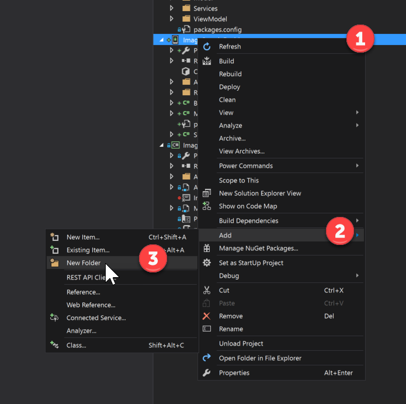

1.  We will now need to add the file ImageAdapter.cs from the Start\\Code Files folder. As we’ve done before we will need to select the project (1), add (2) and existing item (3).

> 

1.  Navigate to the Start\\Code Files folder and select the ImageAdapter.cs file.

> 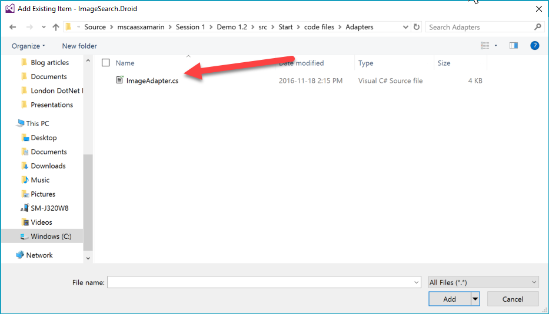

1.  Explain what this adapter does.

2.  Next, In the ImageSearch.Droid project, locate the Resources\\layout\\Main.axml file (1). Explain what this is generally used for. We need to delete this file (2). Again, we will be adding in other files.

> 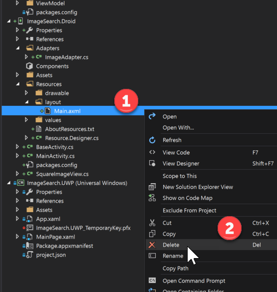

1.  Now we need to add in the layout files in the ImageSearch.Droid project. Same steps as before for adding files. Right-click to bring up the menu (1). Select Add (2) and then select Existing Item (3).

> 

1.  Add the following files from the Code Files\\layout folder: item.axml, main.axml, toolbar.axml.

> 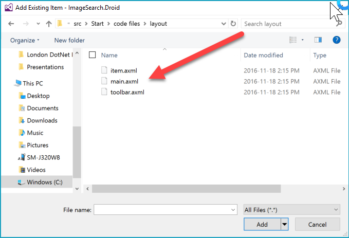
>
> Item.axml – describes the UI for image item in our list of images
>
> Main.axml – is the xml to describe the mainpage of the app
>
> Toolbar.axml – describes the toolbar items of the app
>
> Feel free to dive into these to explain them further

1.  Set the ImageSearch.Droid project as the Startup Project (1).

> 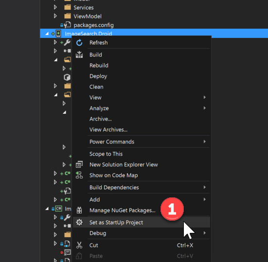

1.  Press F5 to compile and run the project.

2.  Enter Xbox into the search textbox (1) and press the search button (2).

> 

1.  Start a new instance of the UWP app too to show them running side by side.

2.  Give a summary of what we’ve done.

## \
Teardown steps

You need the services for Demo 1.3, otherwise follow the Teardown instructions for Demo 1.3.
