# Demo 1.3: Shared Business Logic & Shared UI

This demo should take about 10 minutes.

## Objectives

The goal here is to show how we can use Xamarin to extend an existing app, build for UWP, to the Android platform, but this time we’ll use Xamarin Forms to create a single UI that is shared between both platforms. We’ll still be sharing business logic code between the UWP and Android clients.

## \
Requirements

-   Hyper-V enabled PC. Required for the Visual Studio UWP and Visual Studio Android emulators.

-   Internet connection to setup and run the demos.

-   Visual Studio 2015 or Community edition with Update 3 - Visual Studio 2015 Community edition is at [https://www.visualstudio.com/vs/mobile-app-development/](https://www.visualstudio.com/vs/mobile-app-development/%20)

-   Visual Studio Android emulator: <https://www.visualstudio.com/vs/msft-android-emulator/>

-   (Optional) Mac for compiling and running the iOS projects. Mac is also required to use the XCode designers within Visual Studio for PC or Mac.

If you encounter issues with connecting Visual Studio debugger with the Visual Studio I would recommend following the steps from this blog article: <http://dotnetbyexample.blogspot.ca/2016/02/fix-for-could-not-connect-to-debugger.html>

## 

## Setup

Make sure Hyper-V is running.

### Cognitive Services

You may have already done the Cognitive Services setup for Demo 1.2, in which case skip to Step 1 below.

You need to register with Cognitive Services APIs at: <https://www.microsoft.com/cognitive-services>.

Registration is free so no API service costs will be incurred.

> 

1.  Once you have registered and verified your account, log into your Cognitive Services account where you should see a list of the available APIs.

2.  Locate the Bing Search - Free service. Select it and agree to the Microsoft Cognitive Services Terms (1) and then click Subscribe (2).

> 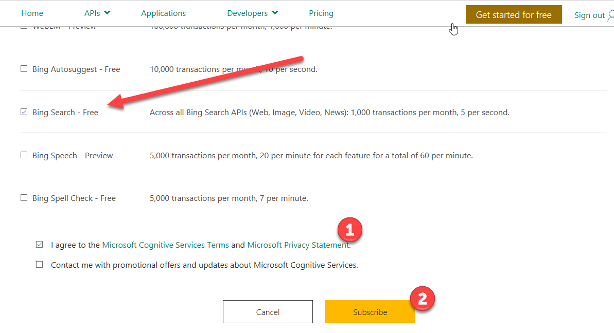

1.  Copy the Key 1 value from Bing Search Free Api. We are going to use this for the demo.

> 

1.  Go to the Solutions folder that comes with this Session’s content, locate the Demo 1.3.zip file, extract it to a new folder under your Documents folder and locate the solution (.SLN) file under the *Start* folder.

2.  To complete the setup, you can test your setup (especially the Android emulator) by opening the solution under the *Complete* folder in Visual Studio 2015 and trying to run the Android version of the application in the Hyper-V-based emulator, noting that the image search API will not be hooked up.

3.  Locate the ServiceKeys.cs file (1) in the ImageSearch (Portable) project. Locate the BingSearch variable and replace the value with the key your copied from the Bing Search API.

> 

### Demo Steps

1.  Open up the extracted solution under the *Start* folder for demo 1.2 in Visual Studio 2015.

2.  Explain that again we are starting with the same existing Windows 10 UWP application from Demo 1.2 using the same 2 projects. One is the main UI using XAML & C\# and the other is a C\# Portable Class Library with view models, models and services. Many UWP XAML application are built with these kinds of classes. Expand the Model, Services & ViewModel folders and provide a quick overview recap of what these do.

3.  Again we will expand the application for use by Android users. So we need to add a new project to the demo solution. This one will be used to create a UI that can be used by both platforms. Locate the Cross-Platform project templates under Visual C\# subgroup (1) and select Blank Xaml App (Xamarin.Forms Portable) project template (2). Name the project ImageSearch.Forms (3) and click OK (4).

> 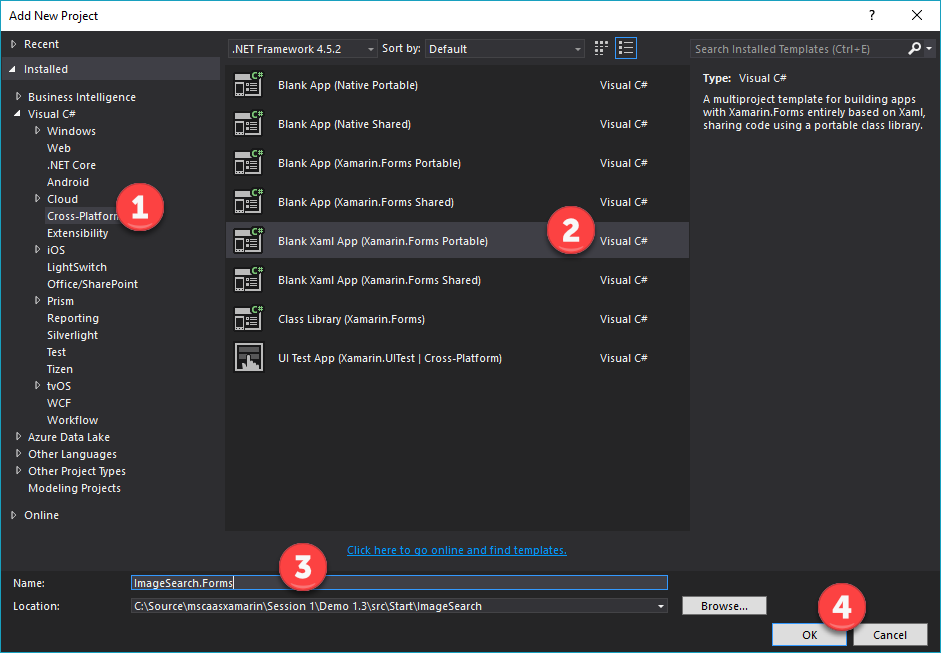

1.  Accept the defaults for the New Universal Windows Project.

> 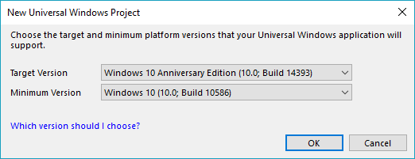

1.  Remove the Windows Phone Silverlight 8.1 and Windows Phone 8.1 projects from the solutions. Explain that these are added and are not needed for this application.

> 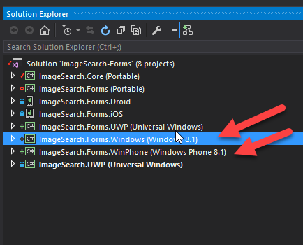

1.  Next, we need to add a Nuget package to the new ImageSearch.Forms project. So right-click on the solution to select the Nuget package manager (1).

> 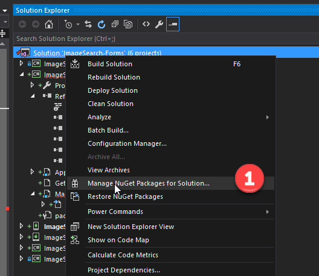

1.  Using the Nuget package manager enter Refractored.MvvmHelp (2) to locate the package and select it (3).

> 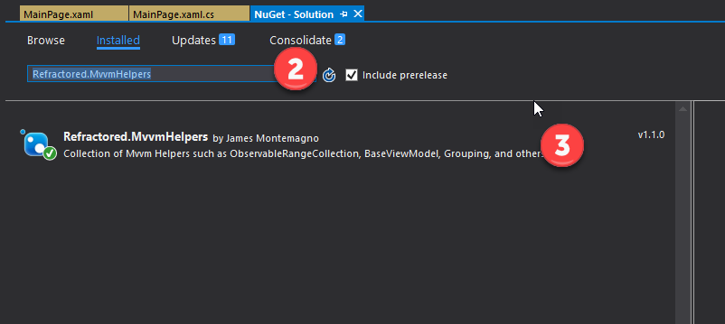

1.  Then add to the Xamarin.Forms project (4). Explain what this does. MvvmHelpers is a collection of Mvvm Helpers such as ObservableRangeCollection, BaseViewModel, Grouping, and others.

> 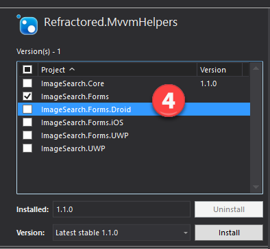

1.  Next, we need to update the Xamarin.Forms nuget packages. This provides bug fixes for the Xamarin.Forms UWP project. Go to Manage NuGet Packaged for Solution on the Solution node (1)

> 

1.  Go to Updates (2), click on Xamarin.Forms (3), select the projects shown and click Install (4).

> 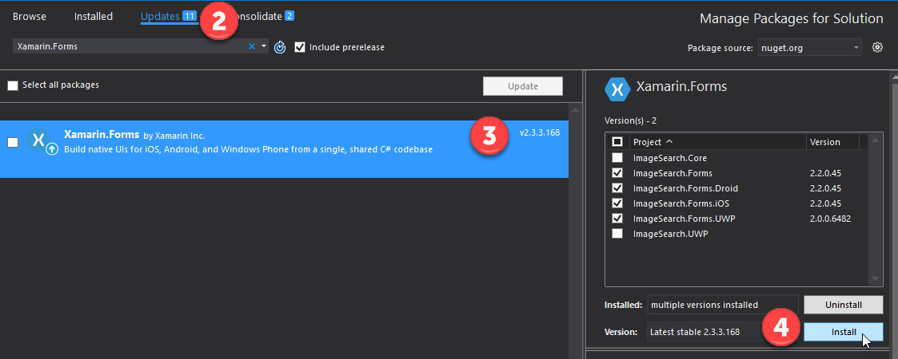

1.  Next we need to add a reference to the ImageSearch.Core (Portable) project by right-clicking and going to Add Reference (1).

> 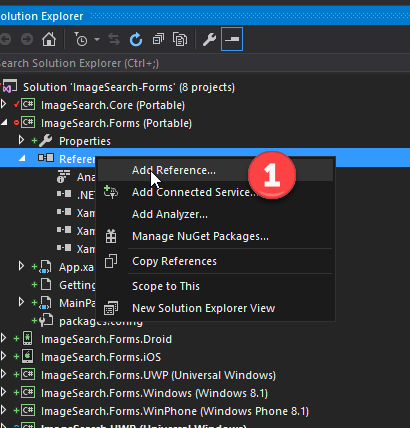

1.  Select the Image.Search.Forms (Portable) project (2) and click OK (3). Explain what this does. This package contains the core logic for calling out to the Bing search service. It retrieves the JSON data and unpackages it into the correct format for the UI to consume.

> 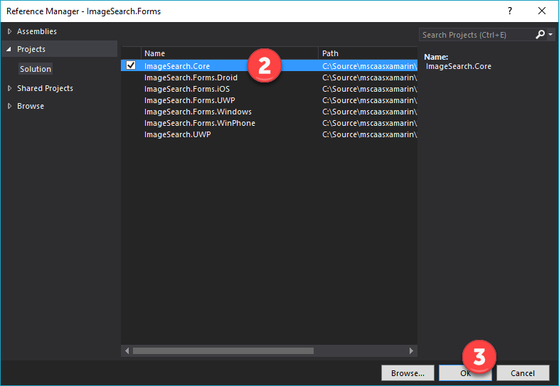

1.  Locate MainPage.xaml in the ImageSearch.Forms project and explain what XAML is and how it is different from .axml.

2.  We need to update the XAML code in the MainPage.xaml. Below is the replacement code for the file.

> &lt;?xml version="1.0" encoding="utf-8" ?&gt;
>
> &lt;ContentPage xmlns="http://xamarin.com/schemas/2014/forms"
>
> xmlns:x="http://schemas.microsoft.com/winfx/2009/xaml"
>
> x:Class="ImageSearch.Forms.MainPage"&gt;
>
> &lt;Grid&gt;
>
> &lt;Grid.RowDefinitions&gt;
>
> &lt;RowDefinition Height="auto"/&gt;
>
> &lt;RowDefinition Height="\*"/&gt;
>
> &lt;/Grid.RowDefinitions&gt;
>
> &lt;StackLayout Grid.Row="0" Margin="20" HorizontalOptions="CenterAndExpand" Orientation="Horizontal"&gt;
>
> &lt;Entry x:Name="MyQuery" Margin="0,0,20,0" WidthRequest="150"/&gt;
>
> &lt;Button Text="Search" x:Name="MyButton" Margin="0,0,10,0" Clicked="MyButton\_Clicked"/&gt;
>
> &lt;ActivityIndicator x:Name="Indicator" Color="Black" /&gt;
>
> &lt;/StackLayout&gt;
>
> &lt;ListView x:Name="ListView" Grid.Row="1" Margin="20"&gt;
>
> &lt;ListView.ItemTemplate&gt;
>
> &lt;DataTemplate&gt;
>
> &lt;ImageCell ImageSource="{Binding ImageLink}" /&gt;
>
> &lt;/DataTemplate&gt;
>
> &lt;/ListView.ItemTemplate&gt;
>
> &lt;/ListView&gt;
>
> &lt;/Grid&gt;
>
> &lt;/ContentPage&gt;

1.  Explain the components of the XAML added.

2.  Next we need to update the code behind file the MainPage. Open up the MainPage.xaml.cs file. Replace the code with the code below:

> using ImageSearch.ViewModel;
>
> using System;
>
> using Xamarin.Forms;
>
> namespace ImageSearch.Forms
>
> {
>
> public partial class MainPage : ContentPage
>
> {
>
> ImageSearchViewModel viewModel;
>
> public MainPage()
>
> {
>
> InitializeComponent();
>
> viewModel = new ImageSearchViewModel();
>
> }
>
> private async void MyButton\_Clicked(object sender, EventArgs e)
>
> {
>
> MyButton.IsEnabled = false;
>
> // Before long running Task (activate and show indicator)
>
> Indicator.IsRunning = true;
>
> Indicator.IsVisible = true;
>
> await viewModel.SearchForImagesAsync(MyQuery.Text.Trim());
>
> ListView.ItemsSource = viewModel.Images;
>
> // After long running Task (deactivate and hide indicator)
>
> Indicator.IsRunning = false;
>
> Indicator.IsVisible = false;
>
> MyButton.IsEnabled = true;
>
> }
>
> }
>
> }

1.  Explain the code added.

2.  Set the ImageSerach.Forms.Droid as the starting project. Then press F5 to run the app. Enter Xbox into the search field and press the Search button.

> 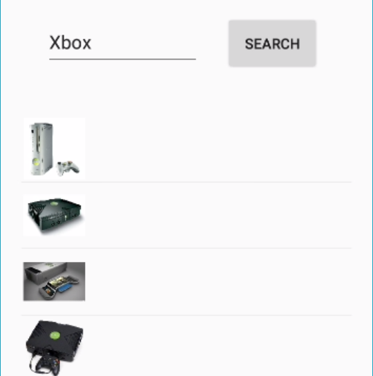

1.  Next, we will be showing the Xamarin.Forms UWP version. Select the ImageSearch.Forms.UWP project (1) and set it as the starting project (2).

    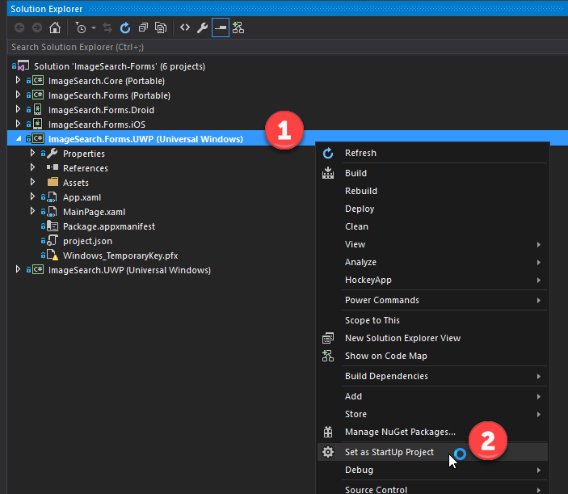

2.  Next, we need to go to the Configuration Manager on the Solution node (1) and check build and deploy options for the ImageSearch.Forms.UWP project and click close (2).

> 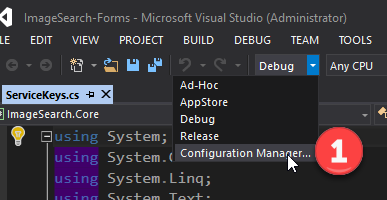
>
> 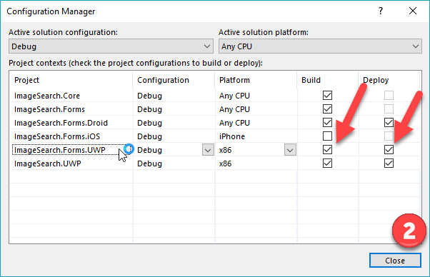

1.  Press F5 to run the project. Enter Xbox (1) and click on the search button (2)

> 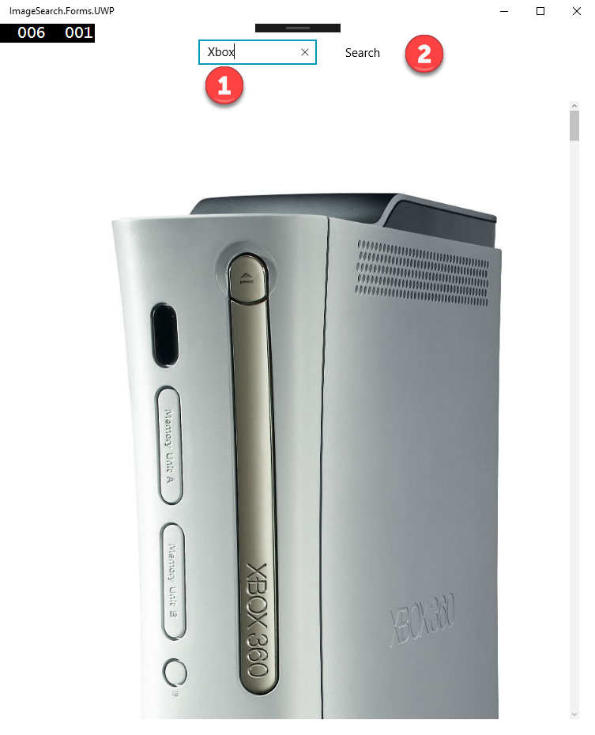

1.  Give a summary of what we’ve done.

### Teardown steps

1.  Login into your Cognitive-service account and make sure to cancel the Bing Search service (1) and confirm (2).

> 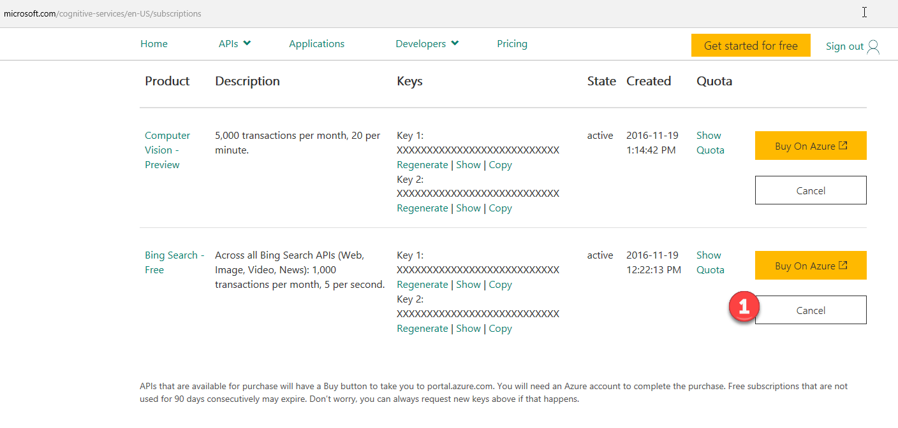
>
> 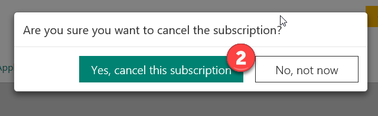

###
