# Demo 2.1: Setting up PCL projects

This demo should take about 7.5 minutes.

## Objectives

See how portable libraries are created that can be referenced by multiple platforms.

## \
Requirements\

Hyper-V enabled PC. Required for the Visual Studio UWP and Visual Studio Android emulators.

Internet connection is required in order to setup and run the demos.

You will need Visual Studio 2015 or Community edition with Update 3

To download Visual Studio 2015 Community edition, [https://www.visualstudio.com/vs/mobile-app-development/](https://www.visualstudio.com/vs/mobile-app-development/%20)

Visual Studio Android emulator: <https://www.visualstudio.com/vs/msft-android-emulator/>

If you encounter issues with connecting Visual Studio debugger with the Visual Studio I would recommend following the steps from this blog article: <http://dotnetbyexample.blogspot.ca/2016/02/fix-for-could-not-connect-to-debugger.html>

(Optional) Mac for compiling and run the iOS projects. Mac is also required to use the XCode designers within Visual Studio for PC or Mac.

## Demo Steps

1.  Go to the Solutions folder with this content, locate the Demo2.1.zip file, extract it to a new folder under your Documents folder.

2.  Create a new blank solution, under Visual C\# template &gt; Other Project Types &gt; Visual Studio Solutions select the Blank Solution template (1). Name the solution GPSImageTag (2). Finally click the ok button to complete the process (3).

> 

1.  Next, we need to add a new project. Bring up the pop menu locate the add option (1). Next select the add New Project option (2).

> 

1.  The new project will use the Portable Class library project to contain the core models, services and utility classes for our application. The Portable Class library project will create an assembly that will be compiled and be referenced by each of the targeted platforms. First, we need to search for project templates named Portable (1). Next, locate the project templated named “Class Library (Portable)” (2). Enter the name “GPSImageTag.Core” (3). Finally, click the OK button finish the process (4).

> 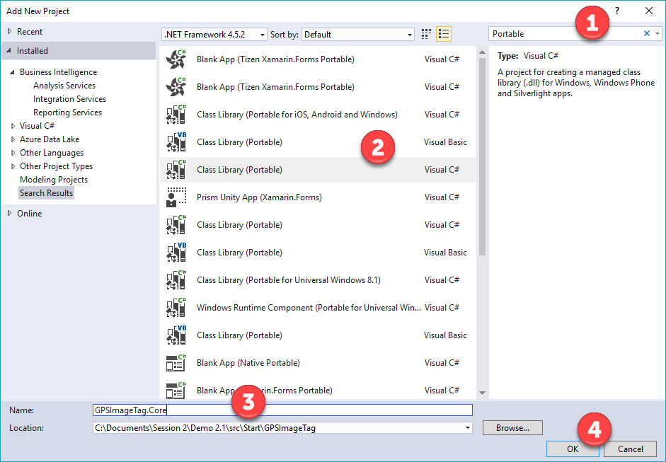

1.  On the next dialog we will select the default. This dialog shows the platforms that we will be targeting for the library class. Press the ok button to complete the process (1). We end up with a library (assisted in Visual Studio by Intellisense) that targets the lowest common denominator.

> 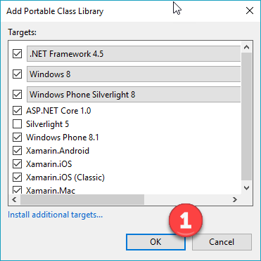

1.  Delete the class1.cs file from the project because we are not using it.

2.  Next, to organize the code with the new project. We need to create the following folders Interfaces, Helpers, Models, and Services. *Repeat the following steps 4 times, once with each folder name*, to create the folders. First bring up the pop menu (1). Next click on the new folder option (2).

> 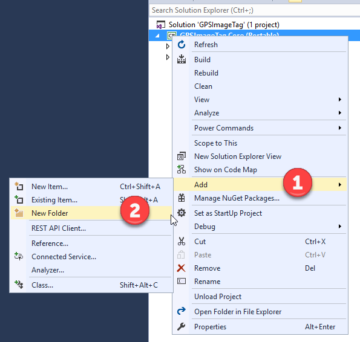

1.  We will be adding the code files to the project to help build the solution. First, let’s add the helper classes. The files will be located in the Documents &gt; Demo2.1 &gt; SRC &gt; Start &gt; Code Files&gt; Helpers. These files will be used to help leverage the Model, View, ViewModel architectural pattern and Inversion of Control within our solution. To add the files, select the Helpers folder in Solution Explorer, bring up the pop menu (1). Next, select the Existing Items options (2). Select all the files and click on the Add button.

> 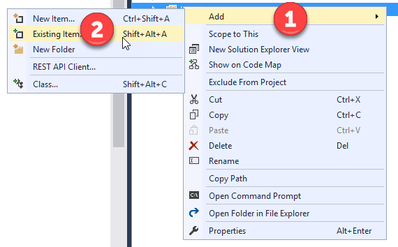
>
> 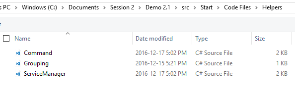

1.  Next, let’s add in the interface classes. This will be used with IOC to abstract the features provided later by concrete platform-specific classes but still allow use to make use of the features in the code in this project. The files will be located in the Documents &gt; Demo2.1 &gt; SRC &gt; Start &gt; Code Files&gt; Interfaces. To add the files, select the Interfaces folder in Solution Explorer, bring up the pop menu (1). Next, select the Existing Items options (2). Select all the files and click on the Add button.

> 
>
> 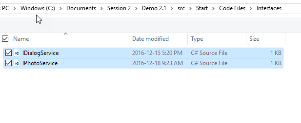

1.  Next, let’s add the model class to the project. The files will be located in the Documents &gt; Demo2.1 &gt; SRC &gt; Start &gt; Code Files&gt; Models. To add the files, select the Models folder in Solution Explorer, bring up the pop menu (1). Next, select the Existing Items options (2). Select all the files and click on the Add button.

> 
>
> 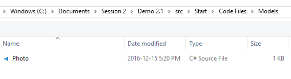

1.  Now, let’s add the services classes to the project. The files will be located in the Documents &gt; Demo2.1 &gt; SRC &gt; Start &gt; Code Files&gt; Services. To add the files, select the Services folder in Solution Explorer, bring up the pop menu (1). Next, select the Existing Items options (2). Select all the files and click on the Add button.

> 
>
> 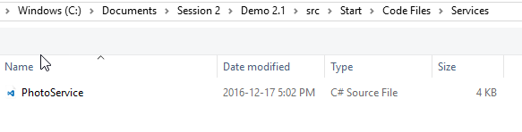

1.  Next, we need to add a new project. Select the Solution node, bring up the pop menu locate the add option (1). Next select the add New Project option (2).

> 

1.  The new project will use the Portable Class library project to provide the ViewModels for our application, as part of the MVVM architecture in the application. ViewModels represent the data that will be used by the View of your application. They wrap the models and provide a surface to which the UI can bind for data and commands, and often methods to save & load data. First, we need to search for project templates named Portable (1). Next, locate the project templated named “Class Library (Portable)” (2). Enter the name “GPSImageTag.ViewModels” (3). Finally, click the OK button finish the process (4).

> 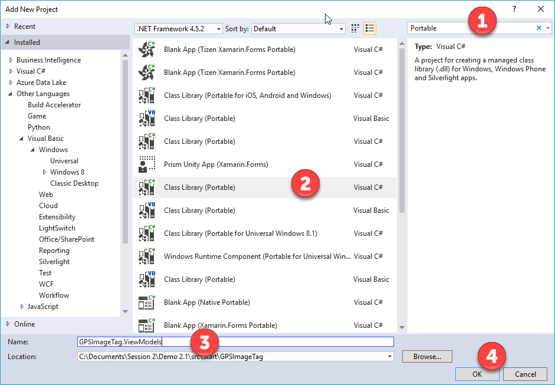

1.  On the next dialog we will select the default. This dialog shows the platforms that we will be targeting for portable library class. Press the ok button to complete the process (1).

> 

1.  Delete the class1.cs file from the project – we are not using it.

2.  Next, to organize the code with the new project. We need to create the following folder ViewModels. First bring up the pop menu (1), but right-clicking on the project node in Solution Explorer. Next click on the new folder option (2).

> 

1.  Now, let’s add the ViewModel classes to the project. We will be adding BaseViewModel which contains common framework code the helps support the MVVM pattern in our solution. CameraPageViewModel will be used to manage the photo data and actions for our camera screen. The files will be located in the Documents &gt; Demo2.1 &gt; SRC &gt; Start &gt; Code Files&gt; ViewModels. To add the files, bring up the pop menu (1) by right-clicking on the ViewModels folder. Next, select the Existing Items options (2). Select all the files and click on the Add button.

> 
>
> 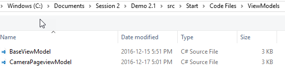

1.  Next, we need to add the reference to the Core project from within the ViewModels project. Select the reference section within GPSImageTag.ViewModels. Bring up the popup menu and select Add Reference option (1). Next select the GPSImageTag.Core to add the project reference. Finally click the OK button (3).

> 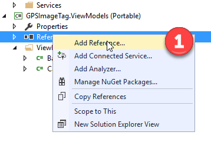
>
> 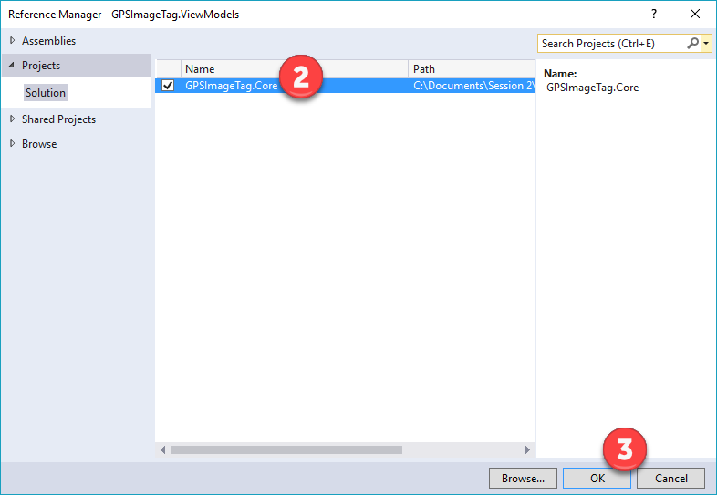

1.  We have not created a shared core code base to which we can add more functionality and which can be referenced by multiple platforms.
