# Demo 2.3: Using Azure mobile services and storage

This demo should take about 5 minutes.

## Objectives

In this demo we explain the use of a backend service in the cloud by using Azure Mobile Services.

## \
Requirements\

Azure mobile services and storage accounts.

Hyper-V enabled PC. Required for the Visual Studio UWP and Visual Studio Android emulators.

Internet connection is required in order to setup and run the demos.

You will need Visual Studio 2015/ or Community edition with Update 3

To download Visual Studio 2015 Community edition, [https://www.visualstudio.com/vs/mobile-app-development/](https://www.visualstudio.com/vs/mobile-app-development/%20)

Visual Studio Android emulator: <https://www.visualstudio.com/vs/msft-android-emulator/>

If you encounter issues with connecting Visual Studio debugger with the Visual Studio I would recommend following the steps from this blog article: <http://dotnetbyexample.blogspot.ca/2016/02/fix-for-could-not-connect-to-debugger.html>

## Setup

Setting up the demo takes a few minutes so make sure to create it before the presentation. Note that the you’ll reuse the same services in session 2 demos.

Setup instructions for both Visual Studio 2015 and Xamarin can be found at Microsoft Developer Network website: <https://msdn.microsoft.com/en-us/library/mt613162.aspx>

To Verify your Xamarin environment, Microsoft Developer Network has a guide walk through of the steps: <https://msdn.microsoft.com/en-us/library/mt488769.aspx>

### Azure Account

An active Azure subscription is required to host both the data and images for the demo mobile app.

1.  Click on the Start free button.

    

2.  Once registration is complete. You will need to log into the Azure portal to continue the demo setup process.

### Setup the Azure Mobile App and Storage services\

1.  Create a resource group to organize and manage all the Azure services that will be used by the demo.

> 

1.  Click on the Add button and enter the name XamarinDemos for the new resource group. The name only needs to be unique with the same Azure subscription. First, open the resource group window (1). Next, click the Add button (2). In the create resource group window, enter the name XamarinDemos(3). Next, make sure to resource group location to your closet region from the drop list (4). Last step, click the Create button to complete the creating the resource group (5)

> 
>
> 

1.  Next, Add a new “Mobile Apps Quickstart” to the resource group created in previous step. Click on the Add button (1). Enter “Mobile Apps QuickStart” into the text search (2). Click on the Mobile Apps QuickStart (3). Finally click on the Create button (4)

> 

1.  At this step we need to name the new Mobile App service. The name has to be globally unique globally Azure. For this setup process I’ve used the name “gpstagimagemobileapp” (1).

> **TIP**: to avoid Azure charges make sure to set the App Service plan to the free tier. I’ve labelled in the above diagram after naming the Mobile Apps Service.
>
> Click the App Service plan (2).\
> Click the Add New button (3).\
> Enter a name for the service plan. It must be unique with the Azure subscription (4).\
> Click View All on the top right of the pricing tier list (5).\
> Scroll down to locate the F1 Free tier (6)(7).
>
> 
>
> **\
> **

1.  Make sure to copy the url for the mobile services. The URL endpoint can be found in the Overview section (1). Copy the URL property (2). We will need this for the demo.

> 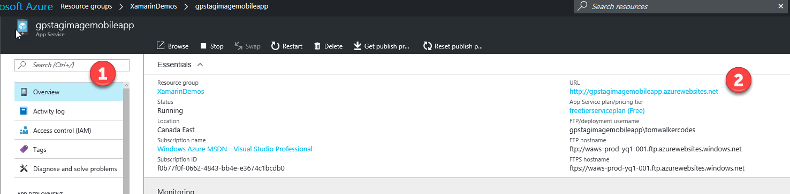

1.  Next, we need to add a ‘Storage account’ service to our resource group. Click the Add button (1). Enter the Storage account as the search option (2). Make sure to select the Storage account with the category of ‘Storage’ (3)

> 

1.  Make sure to give the storage account a unique name. For this setup process I’ve chosen **gpstagimagestorage** as the name (1). Also make sure to select **Locally-redundant storage** (LRS) for the replication setting (2). Click the Create button (3).

    

2.  After the Azure setup process is complete for the storage account. Click on Refresh in the XamarinDemos group to update the list of services. (1)

> 

1.  Select the storage account

2.  Next, In the settings section select Access keys (1). Copy both the Storage account name (1) and the key 1 value (3). We will need both of these to complete the data setup for the demo.

> 

### Code setup

1.  Go to the Solutions folder with this content, locate the Demo2.3.zip file, extract it to a new folder under your Documents folder.

## Demo Steps

Note: If you are not comfortable building the code for the audience, you can load up the finished solution under the Complete folder and walk them through:

-   The WindowsAzure.Storage nuget package added to the UI head projects to talk to Azure storage

-   The Microsoft.Azure.Mobile.Client.SQLiteStore package for the GPSImageTag.Core and UI head projects to sync records with Azure App Service mobile features.

-   The contents of AzureStorageService.cs and Configuration.cs under the GPSImageTag.Shared.Api project which becomes part of all the heads with code to upload content to Azure storage.

-   The AzureService.cs under the Services folder of the GPSImageTag.Core project with code to sync photo records between the client and cloud.

-   The interface code in IAzureService.cs and IAzureStorageService under Interfaces folder of the GPSImageTag.Core project to abstract the services for use in other application layers.

-   The registration of local services classes in MainActivity.cs (for Android), AppDelegate.cs (for iOS) and App.xaml.cs (for UWP).

-   The code in CameraPageviewModel.cs under the ViewModels folder of the GPSImageTag.ViewModels project which calls the appropriate services to upload a photo.

-   The Xamarin.Forms XAML in CameraPage.xaml under the Pages folder of the GPSImageTag portable project which binds to the ViewModel to facilitate taking a picture and uploading it.

-   The application running on the UWP client on Windows to take and upload a picture.

-   The resulting record in the Azure portal

1.  Open up the solution file under the Start folder that you extracted during setup.

2.  We will be using the Azure mobile services in the solution. Azure mobile services provides data storage in the cloud and data functionality on the client using SQLite cloud-based access endpoints, to sync the data between the cloud and clients, as well as the ability to define customized end-point functionality to integrate with other services.

3.  The NuGet package for Azure mobile services has already been added to the GPSImageTag.Core and GPSImageTag UI heads. Bring up NuGet Manager for the solution. Enter the Microsoft.Azure.Mobile.Client.SQLiteStore into the search box (1). Show the version of the NuGet package (2). Next, show the that the package has been added to each of the Xamarin.Forms heads and GPSImageTag.Core (3). While the library is compatible with the portable class library we need to add platform-specific SQLite binaries to each head.

> 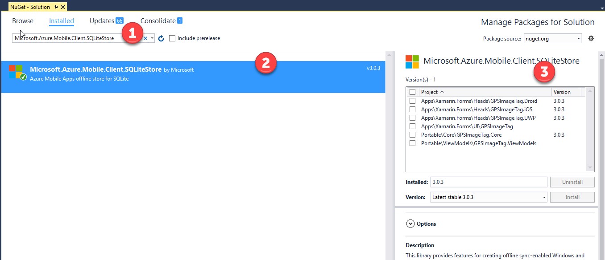

1.  Azure Storage is the other Azure service that is being used within the solution. This provides the access to upload photos to be stored in the Azure Storage container.

2.  Due to the portable class project profile used in this solution the NuGet package is only added to the Xamarin.Forms heads. Bring up NuGet Manager for the solution. Enter the WindowsAzure into the search box (1). Show the version of the NuGet package (2). Next, show the that the package has been added to each of the Xamarin.Forms heads.

> 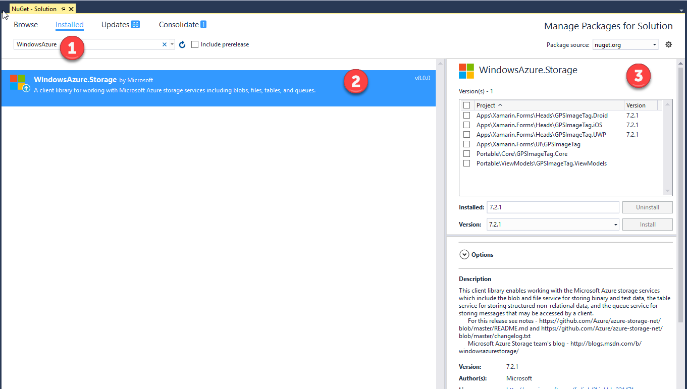

1.  Next, we need to add the code for AzureStorage services into the GPSImageTag.Shared.API. Normally we would have to provide the platform specific code to work with the AzureStorage service. However, we will can use a common code upload feature that will be kept in the Shared project.

2.  Select the GPSImageTag.Shared.API project (1). Bring up the pop menu and select the Add option (2). Next, click the Existing Item (3).

> 

1.  Select the files AzureStorageService.cs and Configuration.cs from the folder the Documents &gt; Demo2.3 &gt; SRC &gt; Start &gt; Code Files&gt; Services (1). Next, click the Add button.

> 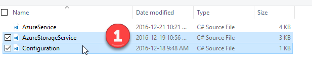

1.  Open the Configuration.cs file in the GPSImageTag.Shared.API. We need to update the Azure Storage connection string. Enter the Azure Storage Account name and Key copied from the Azure portal.

> 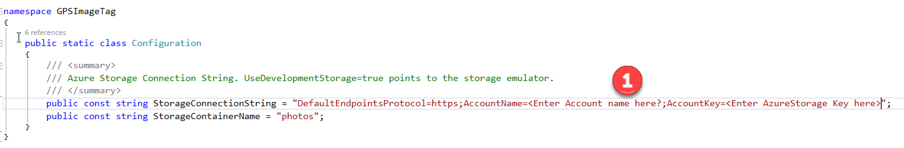

1.  Next, we need to update the GPSImageTag.Core project. In this step we need to update the interfaces. Select the Interfaces folder in the GPSImageTag.Core (1). Bring up the pop menu and select the Add option (2). Next, select the Existing Item option (3).

> 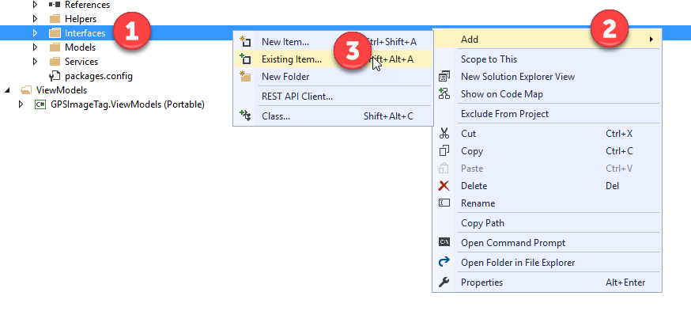

1.  Select the files IAzureService.cs and IAzureStorageService in the folder Documents &gt; Demo2.3 &gt; SRC &gt; Start &gt; Code Files&gt; Interfaces (1). Next, click the Add button.

> 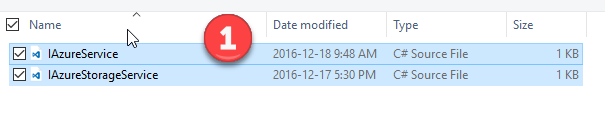

1.  We’ve now added interface to abstract the implementation at the platform-specific level that can be called by our viewmodels and services and the platform-independent portable class library level.

2.  In this step we will be adding the mobile service class file in the GSPImageTag.Core. Select the Services folder in the GPSImageTag.Core project. Now, in the pop up menu select the Add option (2). Next, select the Existing Item option (3).

> 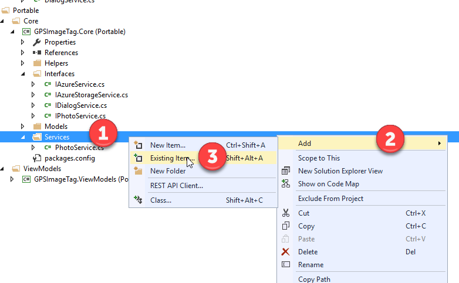

1.  Select the file AzureService.cs in the folder Documents &gt; Demo2.3 &gt; SRC &gt; Start &gt; Code Files&gt; Service (1). Next, click the Add button.

> 

1.  Open the AzureService.cs file in the GPSImageTag.Core project. Update the MobileServiceUrl with the copied Url to the Azure mobile service from the Azure portal.

> 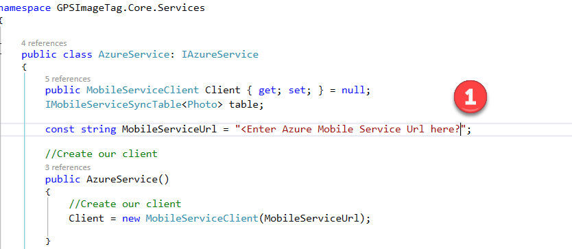

1.  Next, we need to update the viewmodels in the GPSImageTag.ViewModels to use the new services added in the previous steps. Select the ViewModels folder in the GPSImageTag.ViewModels (1). Bring up the pop menu and select the Add option (2). Next, click the Existing Item option (3).

> 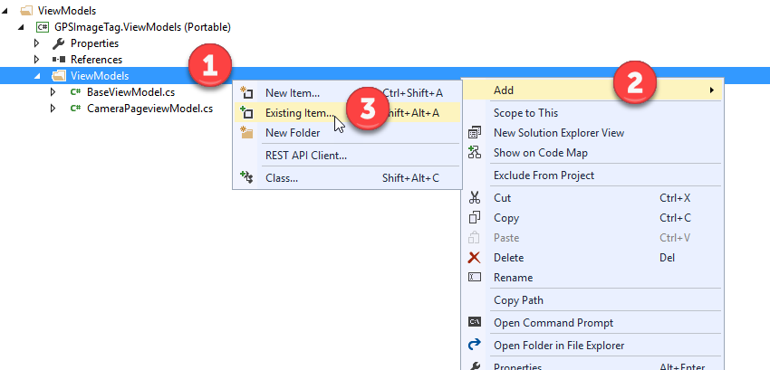

1.  Select the file CameraPageviewModel.cs in the folder Documents &gt; Demo2.3 &gt; SRC &gt; Start &gt; Code Files&gt; ViewModels (1). Next, click the Add button.

> 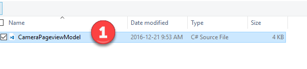

1.  Click on the Yes button to confirm replacing the existing CameraPageViewModel.cs file.

> 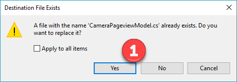

1.  *Open up CameraPageViewModel.cs and show how the services are being called.*

2.  Next we need to update the UI on the camera page in GPSImageTag. Select the Pages folder in the GPSImageTag project (1). Bring up the pop menu and select the Add option (2). Next, click the Existing Item option (3).

> 

1.  Select the files CameraPage.xaml and CameraPage.xaml.cs in the folder Documents &gt; Demo2.3 &gt; SRC &gt; Start &gt; Code Files&gt; Views (1). Next, click the Add button.

> 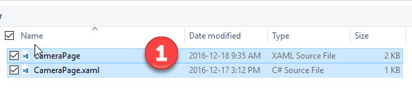

1.  Enable the Apply to all items and Click the Yes button to confirm replacing the existing files.

    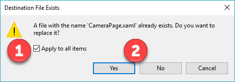

2.  Now, we need to update the service registration within each of the Xamarin.Form head projects.

3.  Open the MainActivity.cs file in the GPSImageTag.Droid project. Update the RegisterService function to include the registration of AzureStorageServcie and AzureService. Add the follow code lines to the RegisterService function.

>         ServiceManager.Register&lt;IAzureStorageService&gt;(new AzureStorageService());
>
>         ServiceManager.Register&lt;IAzureService&gt;(new AzureService());
>
>   

1.  Open the AppDelegate.cs file in the GPSImageTag.iOS project. Update the RegisterService function to include the registration of AzureStorageServcie and AzureService. Add the follow code lines to the RegisterService function

>         ServiceManager.Register&lt;IAzureStorageService&gt;(new AzureStorageService());
>
>         ServiceManager.Register&lt;IAzureService&gt;(new AzureService());

1.  Open the App.xaml.cs file in the GPSImageTag.UWP project. Update the RegisterService function to include the registration of AzureStorageServcie and AzureService. Add the follow code lines to the RegisterService function

>         ServiceManager.Register&lt;IAzureStorageService&gt;(new AzureStorageService());
>
>         ServiceManager.Register&lt;IAzureService&gt;(new AzureService());

1.  Rebuild the solution.

2.  Press F5 to run the UWP client.

3.  Take a photo. Next, enter in the name and description of the photo (1). Next, click the Upload the Photo button (2).

> 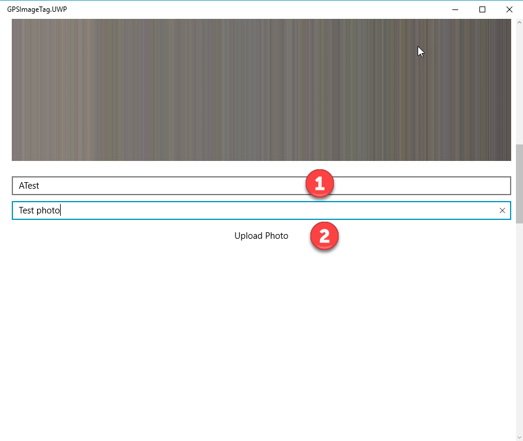

1.  Log into the Azure portal and navigate to the mobile service easy table created for this demo and show the photo has been uploaded (1).

> 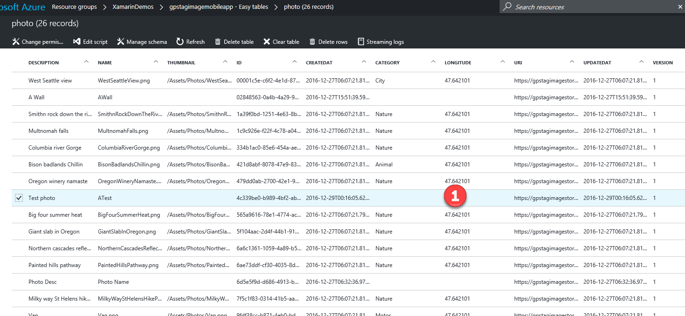

1.  Recap what has been done in the demo.
