# Demo 2.6: Create the Android UI using Xamarin Native

This demo should take about 10 minutes.

## Objectives

In this demo we will be building the a new Android project with a Native Android UI using the Xamarin tools, built on the same foundation projects.

## \
Requirements\

Hyper-V enabled PC. Required for the Visual Studio UWP and Visual Studio Android emulators.

Internet connection is required in order to setup and run the demos.

You will need Visual Studio 2015/ or Community edition with Update 3

To download Visual Studio 2015 Community edition, [https://www.visualstudio.com/vs/mobile-app-development/](https://www.visualstudio.com/vs/mobile-app-development/%20)

Visual Studio Android emulator: <https://www.visualstudio.com/vs/msft-android-emulator/>

If you encounter issues with connecting Visual Studio debugger with the Visual Studio I would recommend following the steps from this blog article: <http://dotnetbyexample.blogspot.ca/2016/02/fix-for-could-not-connect-to-debugger.html>

(Optional) Mac for compiling and run the iOS projects. Mac is also required to use the XCode designers within Visual Studio for PC or Mac.

## Setup

The Android emulator should already be running from Demo 2.5. For the setup, you will need to install the Visual Studio Android emulator.

1.  In Visual Studio, under the Tools menu options (1). Select on the Visual studio Emulator for Android option (2).

> 

1.  Select the Android device profile 5”KitKat (4.4) XXHDPI Phone (1). Click the Run green button (2). Click the Close button (3).

> 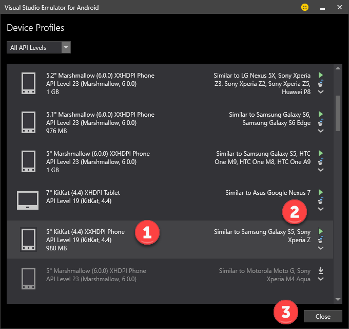

## Demo Steps

1.  Go to the Solutions folder with this content, locate the Demo2.6.zip file, extract it to a new folder under your Documents folder.

2.  Open the solution file under the Start folder.

3.  The Android application “GPSImageTag.DroidNative” is already created for the solution. We will be showing how the project was created.

4.  First, select the Xamarin.Native project folder (1). Bring up the pop menu and select the Add option (2). Next, select the New Project option (3).

> 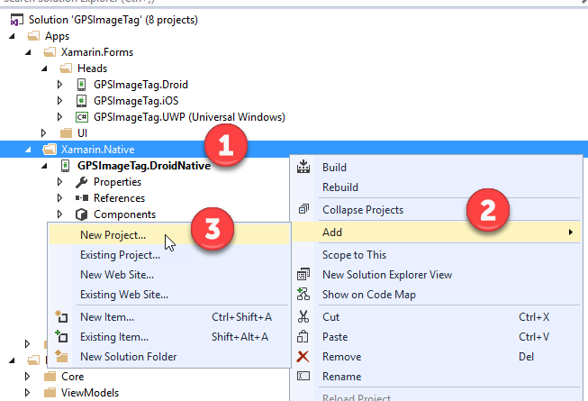

1.  Under the Visual C\# &gt; Android templates (1). Select the Blank App (Android) template (2). Enter the name GPSImageTag.DroidNative for the solution name (3). *Click the Cancel button* (4).

> 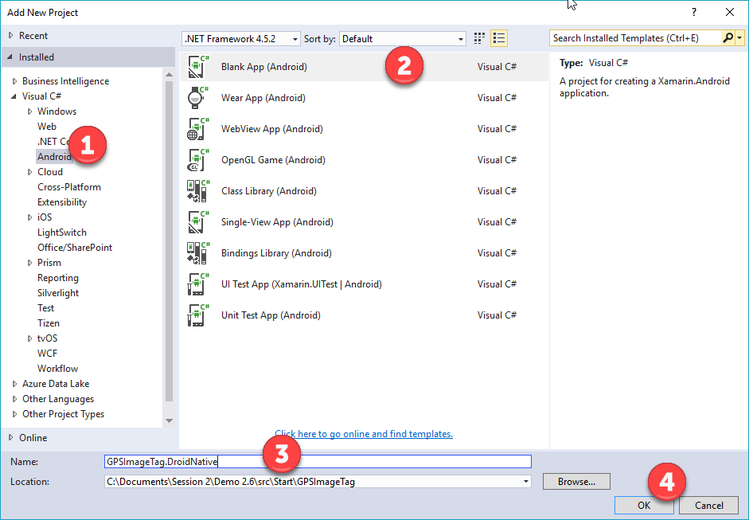

1.  Expand the References tree (1). Show that we are using the same NuGet packages that are being used in the Xamarin.Forms Android client (2).

> 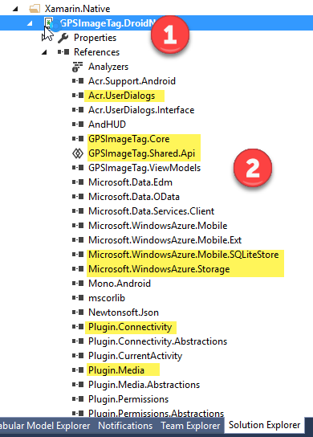

1.  Expand the Components tree (1). Xamarin Components are similar to NuGet packages. Here we are leverage the Url Image View Helper. This provides the ability to use image place holders while our images are being downloaded from Azure. This allows the UI thread to render the page without waiting for any of the images to be downloaded.

> 

1.  Select the GettingStarted.Xamarin and MainActivity.cs files (1). Bring up the pop menu and select the Delete option (2).

> 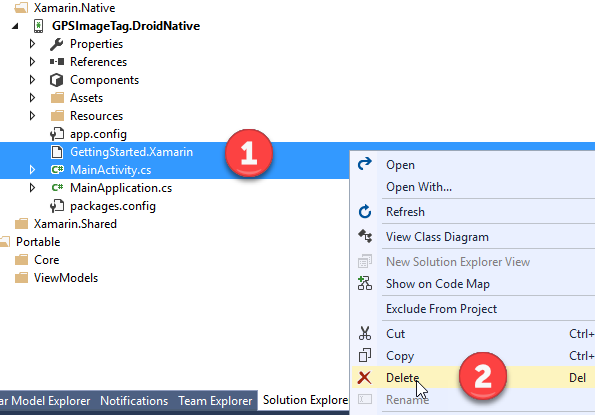

1.  Select the GPSImageTag.DroidNative project (1). In the pop menu select the Add option (2). Now, select the Existing Item option (3).

> 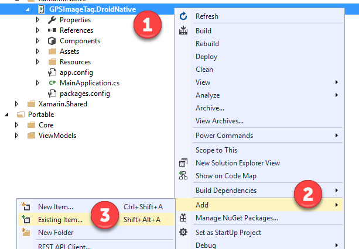

1.  Select file MainActivity.cs from the folder the Documents &gt; Demo2.6 &gt; SRC &gt; Start &gt; Code Files (1). Next, click the Add button. MainActivity is the starting point for our Android application.

> 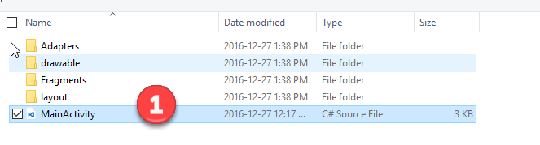

1.  Select the GPSImageTag.DroidNative project (1). In the pop menu select the Add option (2). Now, select the New Folder option (3).

> 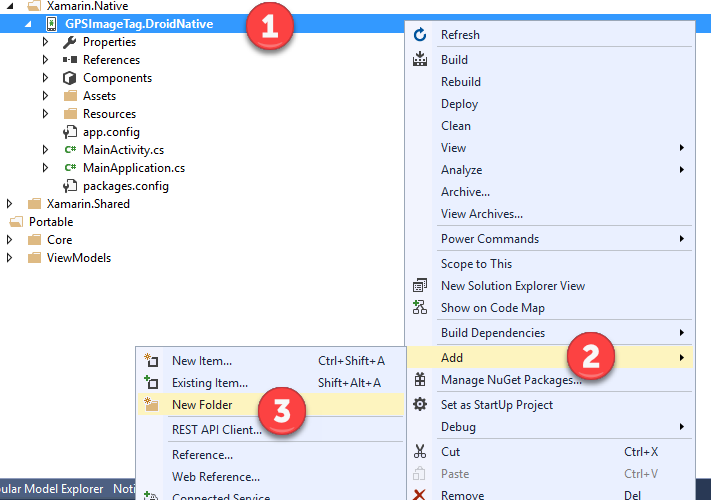

1.  For the name folder enter “Fragments” (1).

> 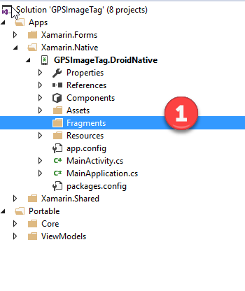

1.  Select the Fragments folder within the GPSImageTag.DroidNative (1). In the right-lick menu select the Add option (2). Now, select the Existing Item option (3).

> 

1.  Select all the files CameraFragment.cs and PhotosListFragment.cs from the folder the Documents &gt; Demo2.6 &gt; SRC &gt; Start &gt; Code Files &gt; Fragments (1). Next, click the Add button.

> 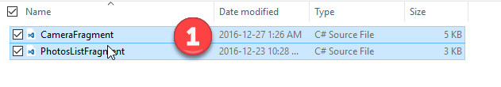

1.  Open the CameraFragments.cs file (1). Fragments represent user controls for the Android platform. Here we are see the code for the Camera page. The fragment connects the layout which defines the UI elements for the page. In the OnCreateView function we can see where the layout (UI page) is connected to the fragment.

> 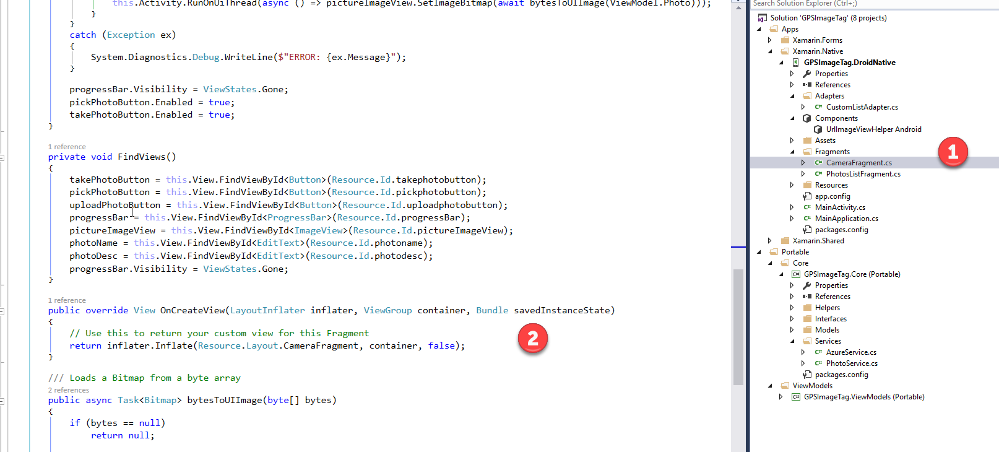

1.  Select the layout folder within the GPSIamgeTag.DroidNative project. In the pop menu select the Add option (2). Now, select the Existing Item option (3).

> 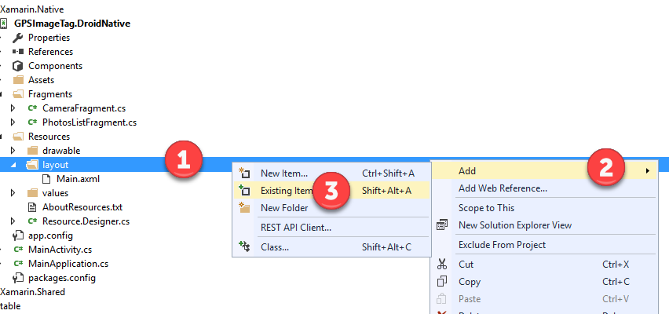

1.  Select all the files CameraFragment.axml, ListRowLayout.axml, Main.axml and PhotosListFragments.axml from the folder the Documents &gt; Demo2.6 &gt; SRC &gt; Start &gt; Code Files &gt; Layouts (1). Next, click the Add button.

> 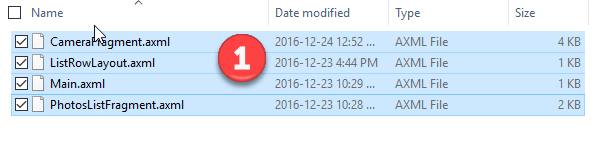

1.  Enable the Apply to all items (1). Then Click the Yes button to confirm replacing the existing files (2).

> 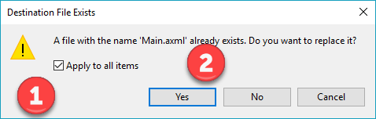

1.  Open the CameraFragment.axml file. Android uses xml files to define the user pages. Here we could use the built-in Android design to drag controls (2) onto the designer surface (3). Open up the toolbox window if it isn’t showing.

> 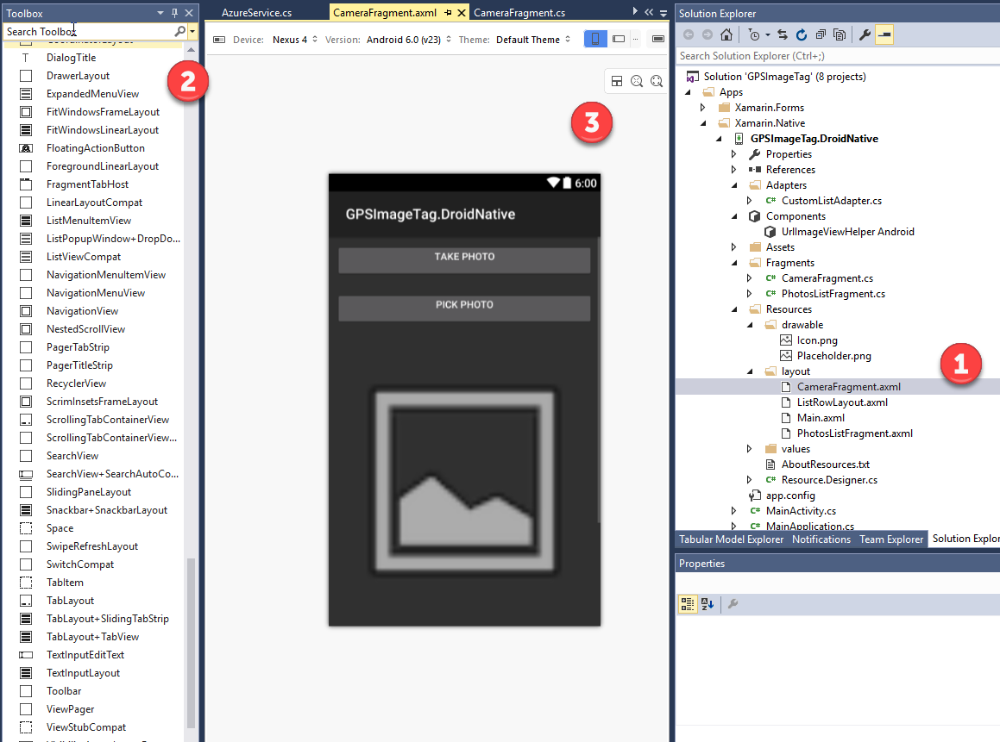

1.  Open the PhotosListFragment.axml using right-click, then Open With and then select XML (TEXT) Editor (1). Here we are seeing the XML tags that defined the photo list view (2).

> 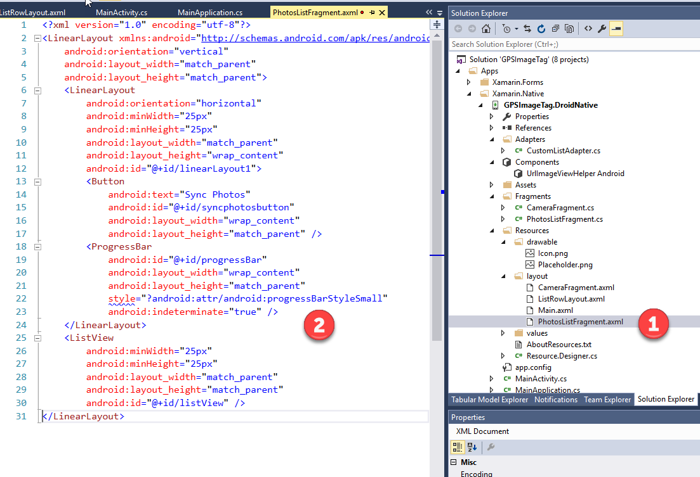

1.  Open the ListRowLayout.axml file using right-click, then View Code (1). This is the XML that defines the individual row items in the photos list view page.

> 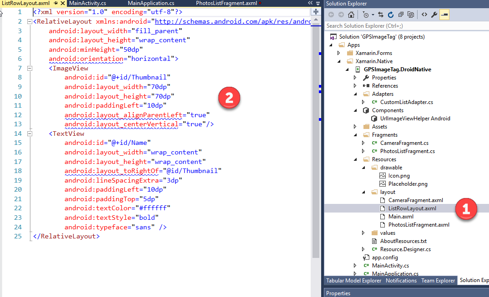

1.  Select the drawable folder within the GPSIamgeTag.DroidNative project. In the pop menu select the Add option (2). Now, select the Existing Item option (3).

> 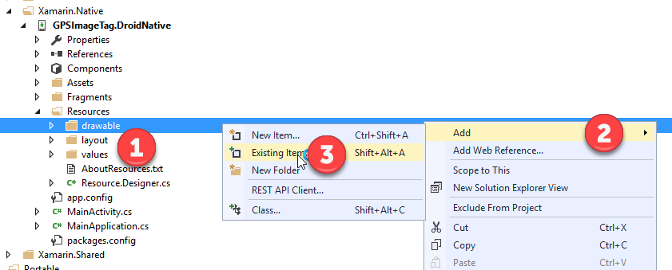

1.  Select the file Placeholder from the folder the Documents &gt; Demo2.6 &gt; SRC &gt; Start &gt; Code Files &gt; drawable (1). Next, click the Add button.

> 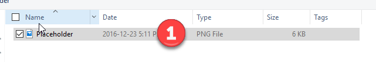

1.  Select the GPSImageTag.DroidNative project (1). In the pop menu select the Add option (2). Now, select the New Folder option (3).

> 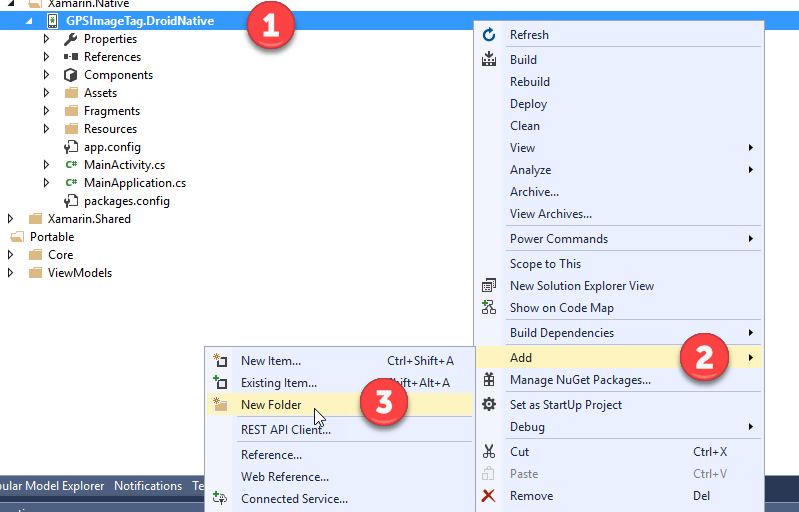

1.  Name the folder Adapters.

> 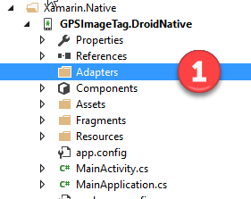

1.  Select the Adapters folder within the GPSIamgeTag.DroidNative project. In the pop menu select the Add option (2). Now, select the Existing Item option (3).

> 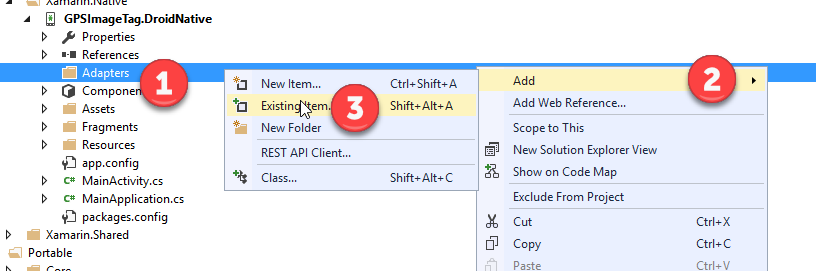

1.  Select the file CustomListAdapter.cs from the folder the Documents &gt; Demo2.6 &gt; SRC &gt; Start &gt; Code Files &gt; Adapters (1). Next, click the Add button.

> 

1.  Open the CustomListAdapters.cs (1). This adapter is used to build the list of items for our Photos page. In the GetView function we can see on the row item layout ListRowLayout is referenced to build the UI and data bind to the data returned from Azure.

> 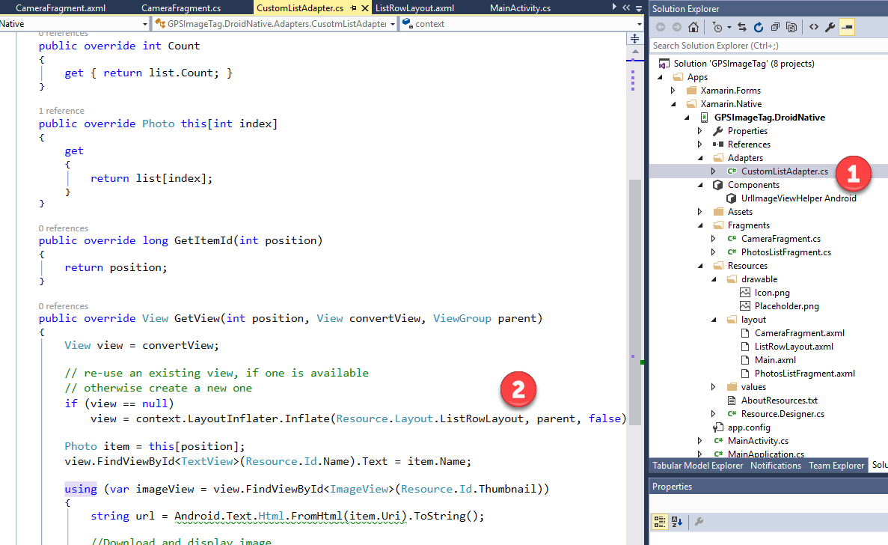

1.  Press F6 to build the solution

2.  Press F5 to run the Android native client.

3.  Press the Upload Photo tab to bring up the camera page (1). Next press the Take Photo button to snap a picture (2).

    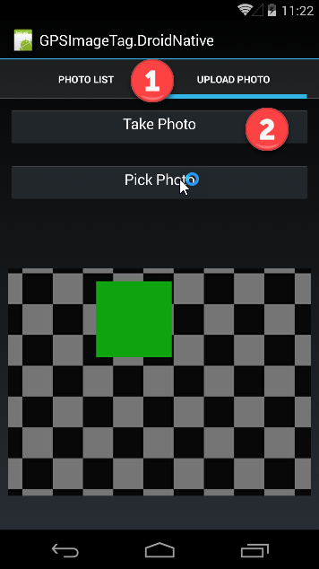

4.  Press the Sync Photos button (1). The list will be update with all the photos stored in Azure (2).

> 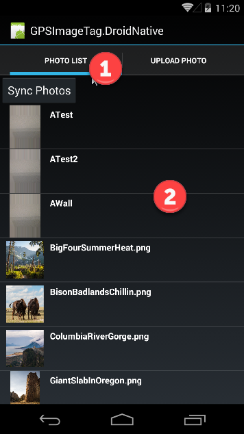

1.  Summarize what was accomplished in the demo.
