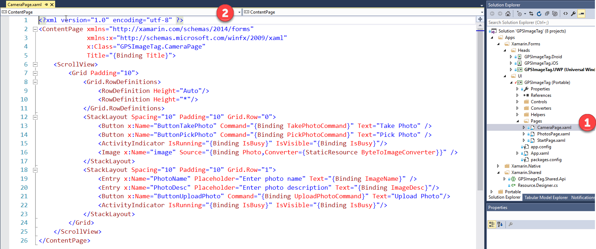
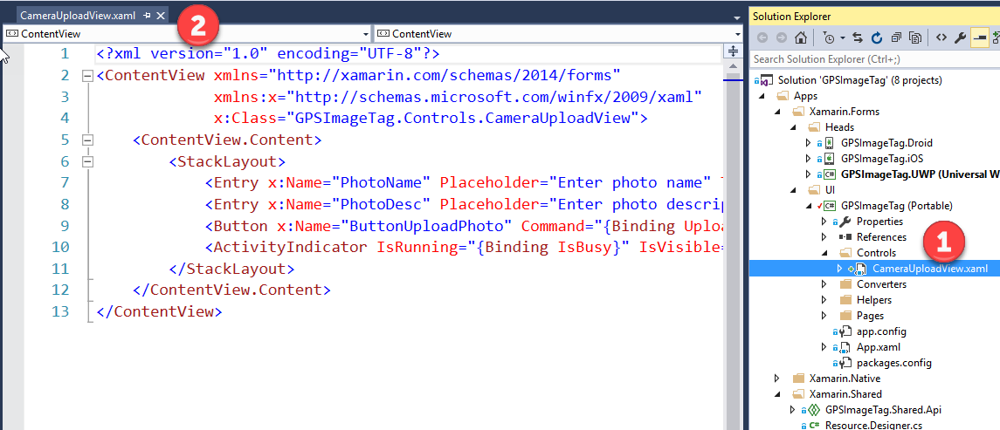
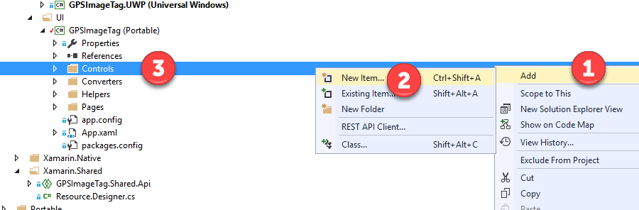
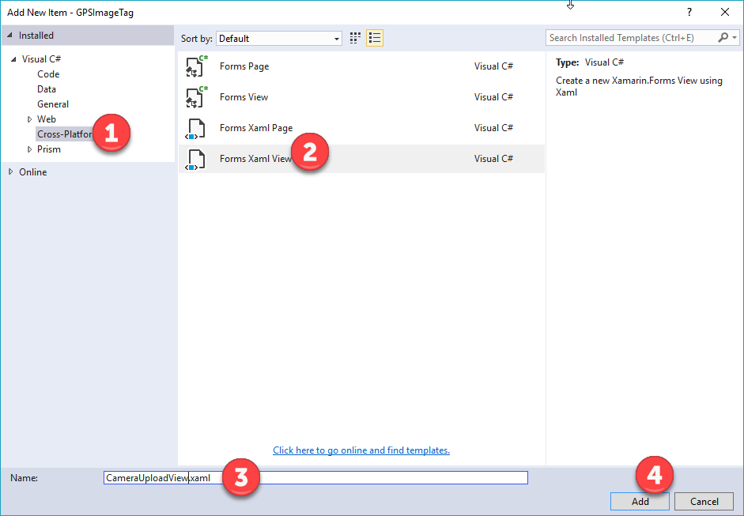
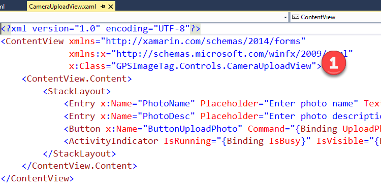
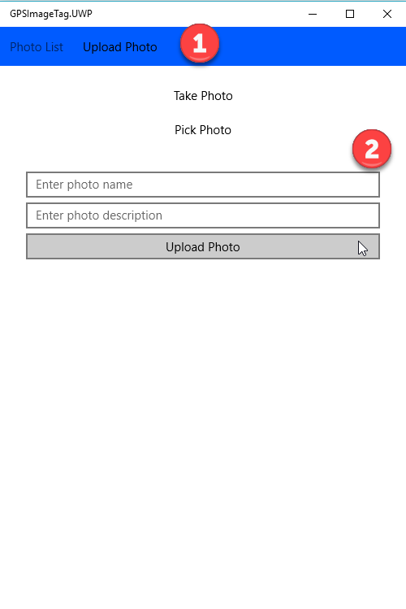

# Demo 3.1: User Controls

This demo should take about 4 minutes.

## Objectives

This demo will be show how to create a ‘user control’ for a Xamarin.Forms application.

## 

## Requirements\

Hyper-V enabled PC. Required for the Visual Studio UWP and Visual Studio Android emulators.

Internet connection is required in order to setup and run the demos.

You will need Visual Studio 2015 or Community edition with Update 3

To download Visual Studio 2015 Community edition, [https://www.visualstudio.com/vs/mobile-app-development/](https://www.visualstudio.com/vs/mobile-app-development/%20)

Visual Studio Android emulator: <https://www.visualstudio.com/vs/msft-android-emulator/>

If you encounter issues with connecting Visual Studio debugger with the Visual Studio I would recommend following the steps from this blog article: <http://dotnetbyexample.blogspot.ca/2016/02/fix-for-could-not-connect-to-debugger.html>

(Optional) Mac for compiling and run the iOS projects. Mac is also required to use the XCode designers within Visual Studio for PC or Mac.

## Demo Steps

1.  To optimize UI code and prevent code duplication we can encapsulate parts of the UI for re-use.

2.  Go to the Solutions folder with this content, locate the Demo3.1.zip file, extract it to a new folder under your Documents folder. Open the Visual Studio Solution file.

3.  Find the CameraPage file in Solution Explorer from the Pages folder found in the GPSImageTag(Portable) project (1). Open the page in the editor (2). Walk through the controls. We will be moving the XAML code for the 2 textboxes and the upload button into a user control.

> 

1.  Explain this is page for taking photos and doing upload, mentioning controls used.

2.  We already have the new View control created in the solution. The new view control can be found in the GPSImageTag (Portable) project under the Controls folder (1). Show the XAML code that makes up the controls for the view. (2)

> 

1.  You can show how this file would have been added if it were not already there. You would select the Controls folder in the GPSImageTag (Portable) project, bring up the pop menu and select (1). Select the Add menu option (2) and then select add New Item (3).

> 

1.  Next, Select Cross-Platform template group (1). In the templates select “Forms Xaml View” (2). Give it a name of CameraUplodView.xaml (3). Click Add to complete the operation (4). Do not click add because the file has already been added. This is just to explain how it would be done.

> 

1.  Open the already-created CameraUploadView.xaml found the Controls folder in the GPSImageTag (Portable) project. Show the prefix declaration and how it causes a namespace of classes to become available (1). This will be used to reference this control view in the CameraPage.xaml

> 

1.  Open the CameraPage.Xaml. We need to add the Xaml namespace to the new CameraUpload View “**xmlns:controls=”clr-namespace:GPSImageTag.Controls**” (1). Replace the XAML code for the 2 textboxes and upload button with the XAML control tag to the new CameraUploadView **“&lt;controls:CameraUploadView /&gt;”** (2)

> 

1.  Run the UWP client and select the Upload Photo tab option (2). This will bring up the camera page where we can see the page now uses the CameraUploadView control.

> 
