# Demo 3.2: Branding

This demo should take about 4 minutes.

## Objectives

Introduce Custom Renderers

## \
Requirements\

Hyper-V enabled PC. Required for the Visual Studio UWP and Visual Studio Android emulators.

Internet connection is required in order to setup and run the demos.

You will need Visual Studio 2015 or Community edition with Update 3

To download Visual Studio 2015 Community edition, [https://www.visualstudio.com/vs/mobile-app-development/](https://www.visualstudio.com/vs/mobile-app-development/%20)

Visual Studio Android emulator: <https://www.visualstudio.com/vs/msft-android-emulator/>

If you encounter issues with connecting Visual Studio debugger with the Visual Studio I would recommend following the steps from this blog article: <http://dotnetbyexample.blogspot.ca/2016/02/fix-for-could-not-connect-to-debugger.html>

(Optional) Mac for compiling and run the iOS projects. Mac is also required to use the XCode designers within Visual Studio for PC or Mac.

## Setup

Get the Android emulator running ahead of the. Use the link above to install the Visual Studio Android emulator if you don’t have it already.

1.  In Visual Studio, under the Tools menu options (1). Select the Visual studio Emulator for Android option (2).

> 

1.  Select the Android device profile 5”KitKat (4.4) XXHDPI Phone (1). Click the Run green button (2). Click the Close button (3).

> 

## Demo Steps

1.  Go to the Solutions folder with this content, locate the Demo3.2.zip file, extract it to a new folder under your Documents folder. Open the Solution file under the Start menu in Visual Studio.

2.  Set the Xamarin.Form Android project as the starting project by bringing up the pop menu and select the option Set as Strartup Project (1).

> 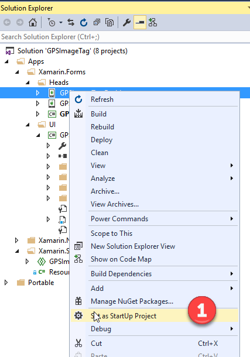

1.  Press F5 to run the Xamarin.Forms Android project.

2.  Select the Upload Photo tab (1). Take note that the buttons on the page are not rounded (2). For this demo we want to be able to apply a rounded button style for our Android client.

> 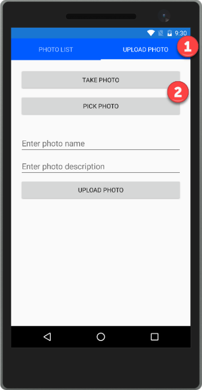

1.  Stop debugging.

2.  It these next steps we will be applying a button style to help define the appearance of the buttons.

3.  Open the App.xaml file found in the GPSImage (Portable) project (1). Note that there is a BorderRadius defined on the button but that BorderRadius is not being applied to the buttons in the app.

> 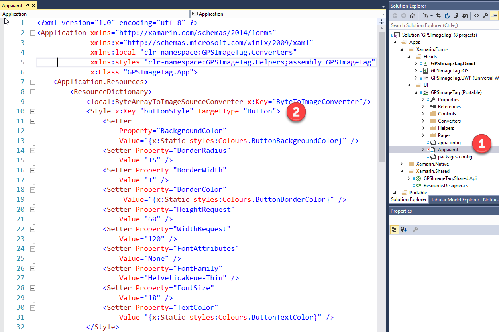

1.  Let’s apply the style to the buttons on the CameraPage.xaml found in the Pages folder in the GPSImageTag (Portable) project (1).

> 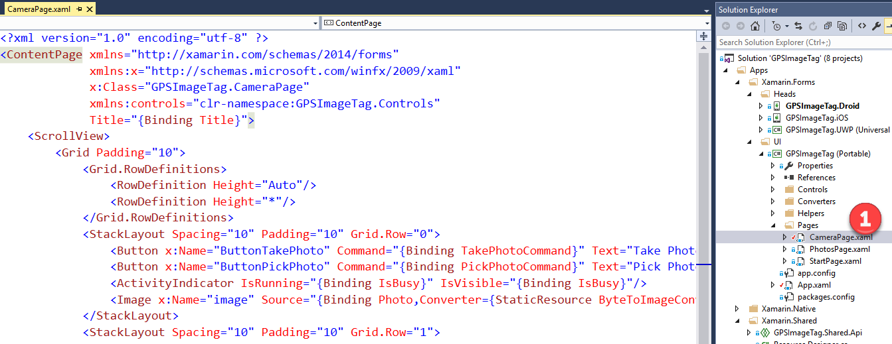

1.  For the two buttons in the CameraPage.xaml we will add in the Styles property to each button Xaml control. Below is the updated Xaml code for each button.

> &lt;Button x:Name="ButtonTakePhoto" Command="{Binding TakePhotoCommand}" Text="Take Photo" Style="{StaticResource buttonStyle}"/&gt;
>
> &lt;Button x:Name="ButtonPickPhoto" Command="{Binding PickPhotoCommand}" Text="Pick Photo" Style="{StaticResource buttonStyle}"/&gt;

1.  Run the Android client. Select the Upload Photo tab to display the Camera Page (1). We can see the new button style being applied. However, we still don’t have rounded buttons. Xamarin.Forms does provide a BorderRadius property for the button control.  However as of this writing the property is only recognized by iOS and recently in UWP. Unfortunately, it’s not used in the rendering of the button on Android.

> 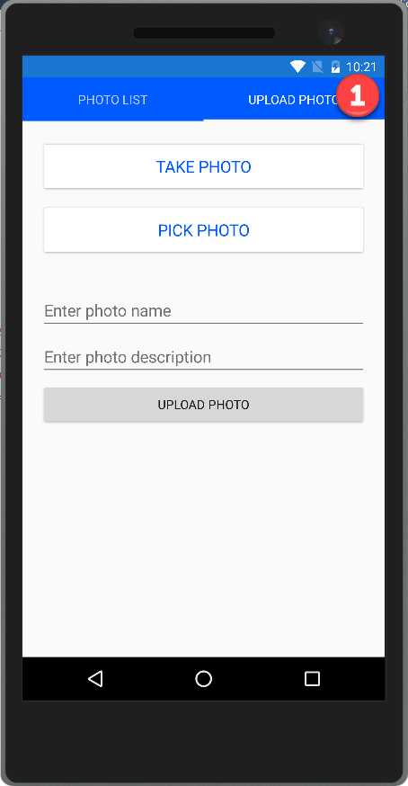

1.  To fix this on Android we need to override how the Xamarin.Forms renderer draws the button.

2.  The first step is to create a custom button class that will inherit from the Xamarin.Forms Button class.

3.  Open RoundedButton.cs found under the Controls folder in the GPSImageTag (Portable) project (1). You can see there is not much code here (2). This class does inherit its properties from the Xamarin.Forms Button class. We define this class so we have something against which we can apply customized rendering and so we can pick which buttons will get the rounded treatment.

> 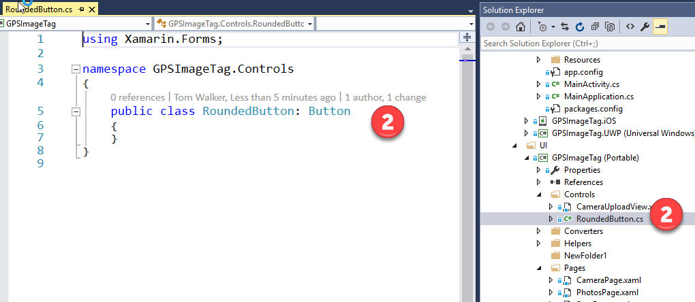

1.  We need to instruct the Xamarin.Forms control renderer within the Android client project how we want our new RoundedButton control to be drawn.

2.  Open RoundedButtonRenderer.cs found under the CustomRenders folder in the GPSImageTag.Droid project (1). The next step is to uncomment the ***1^st^*** ExportRender Attribute for the RoundedButton (2).

> 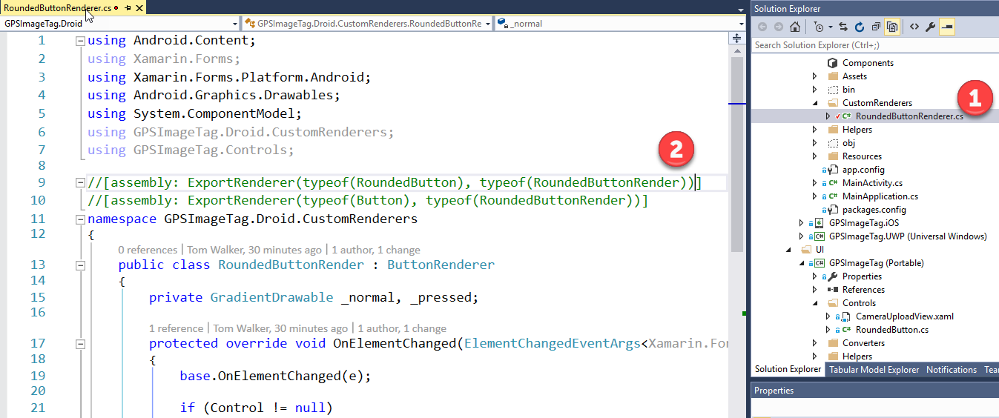

1.  Point out and explain the ExportRendereAttribute which means that any "RoundedButton" used in Xamarin Forms XAML will use this rendering class.

2.  In the renderer, we override the OnElementChanged on the control. This is called when the control is rendered on the page.

3.  Go through the steps to show how the Border is changed.

4.   The other method that is overridden in the renderer is the OnElementPropertyChanged. This method is always triggered when a property on our Rounded Button is updated. The 3 properties that we want to act on are the BorderRadius, BorderWidth and BorderColor.

5.    Let’s go back to CameraPage and change the 1st Button to be RoundedButton (1) using a suitable Xaml prefix (2). Below is the updated Xaml code.

> 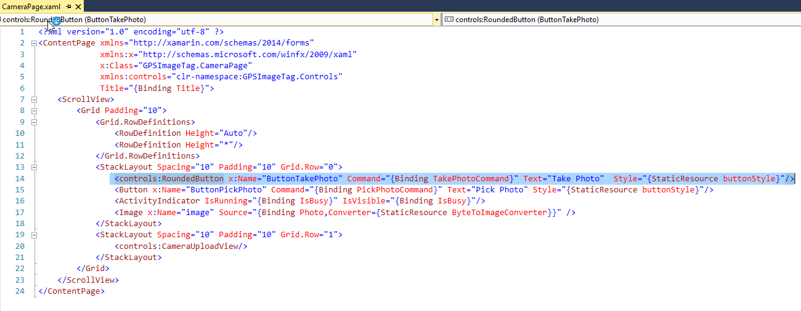

1.    Press F5 to run the Android client.

2.    Select the Upload Photo tab (1). We can see here that the button now has a rounded border.

> 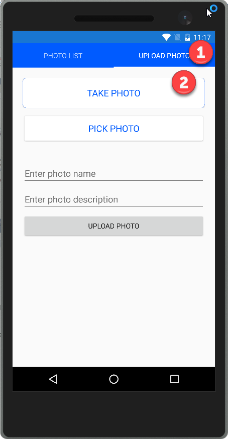

1.    Since this RoundedButton is derived from Button, on iOS and UWP it will count as a regular Button with a radius that shows up. This means we don’t need to build a customer renderer for iOS and UWP clients.

2.    Stop debugging

3.    Go back to RoundedButton renderer (1) and uncomment ***2nd*** attribute line (2).

> 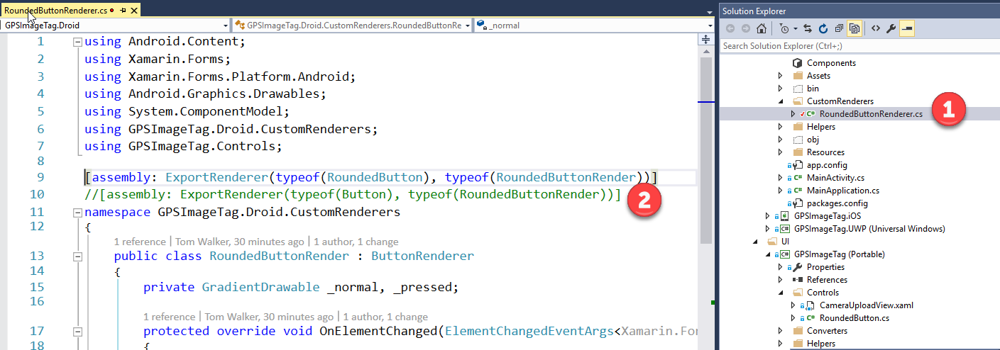

1.    Go to the CameraPage (1) and change RoundedButton Xaml control back to a Button control (2).

> 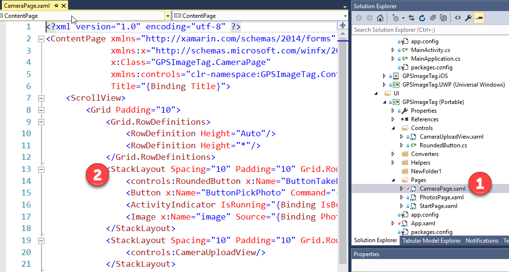

1.    Press F5 to run the Android Client. Select the Upload Photo tab (1). We can see now that all the buttons that have their BorderRadius property set have their rounded appearance.

> 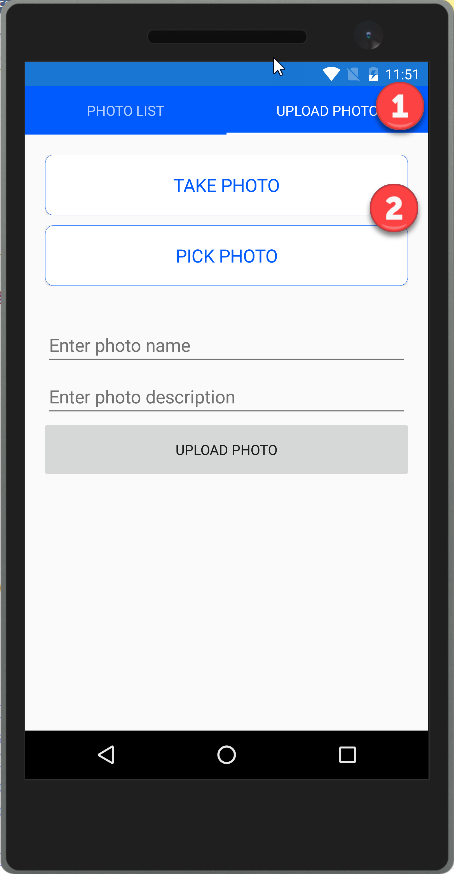

1.    With iOS and UWP we don’t need to code a custom renderer because the BorderRadius is applied correctly. We have the choice with a custom renderer to create a specific derived class for custom rendering or to apply a custom renderer to all instance of an existing control.
