# Demo 3.3: Wrappers

This demo should take about 4 minutes.

## Objectives

Is this demo we will be looking at how to add existing Java code into a Xamarin application.

## \
Requirements\

Hyper-V enabled PC. Required for the Visual Studio UWP and Visual Studio Android emulators.

Internet connection is required in order to setup and run the demos.

You will need Visual Studio 2015 or Community edition with Update 3

To download Visual Studio 2015 Community edition, [https://www.visualstudio.com/vs/mobile-app-development/](https://www.visualstudio.com/vs/mobile-app-development/%20)

Visual Studio Android emulator: <https://www.visualstudio.com/vs/msft-android-emulator/>

If you encounter issues with connecting Visual Studio debugger with the Visual Studio I would recommend following the steps from this blog article: <http://dotnetbyexample.blogspot.ca/2016/02/fix-for-could-not-connect-to-debugger.html>

(Optional) Mac for compiling and run the iOS projects. Mac is also required to use the XCode designers within Visual Studio for PC or Mac.

## Setup

Get the Android emulator running ahead of the. Use the link above to install the Visual Studio Android emulator if you don’t have it already.

1.  In Visual Studio, under the Tools menu options (1). Select the Visual studio Emulator for Android option (2).

> 

1.  Select the Android device profile 5”KitKat (4.4) XXHDPI Phone (1). Click the Run green button (2). Click the Close button (3).

> 

## Demo Steps

1.  Go to the Solutions folder with this content, locate the Demo3.3.zip file, extract it to a new folder under your Documents folder. Open the Solution file under the Start folder in Visual Studio.

2.  Select the Native Android project (“GPSImageTag.DroidNative”) (1). Bring up the pop menu and select Set as Startup project (2).

> 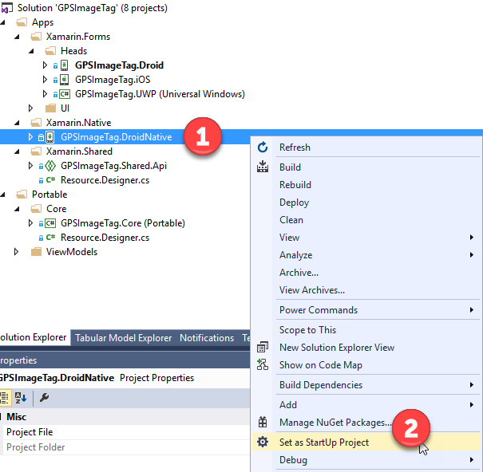

1.  In this demo we will be looking at how we can use our existing Native Java library in our Xamarin Android application. In this scenario the business may not have the available resources to port existing Java code base to C\#

2.  Expand the Java node in Solution Explorer to show the PicassoWrapper project (1).

> 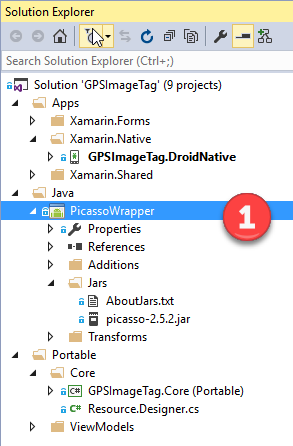

1.  Explain that if you were going to create the Java Binding Project, you would first select the Java folder (1), bring up the pop menu and select Add (2), then select New Project (3).

> 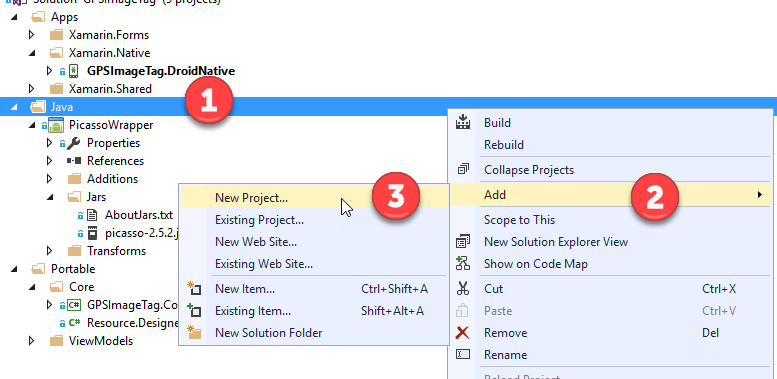

1.  You would then select the Android group (1, select the Bindings Library (Android) project (2), give it a name, e.g. PicassoWrapper (3). Since we’ve already created the project just click the Cancel button (4).

> 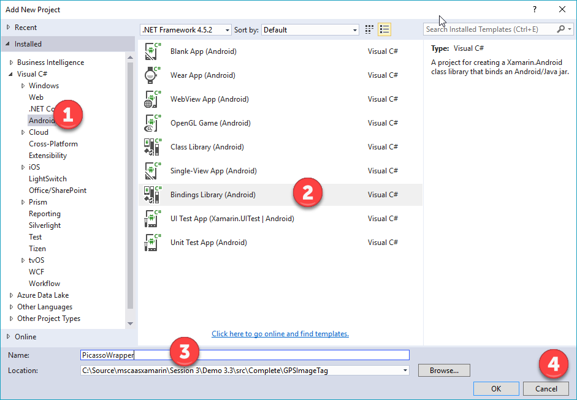

1.  We can see that the Java .jar for Picasso has been added to the Jars folder within the Binding Library project (1).

> 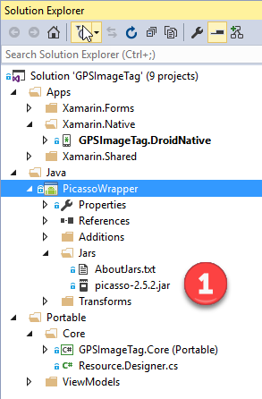

1.  We should check that the build action on the Picasso.jar file from InputJar is set to EmbeddedJar to package it with the assembly, and therefore the app.

> 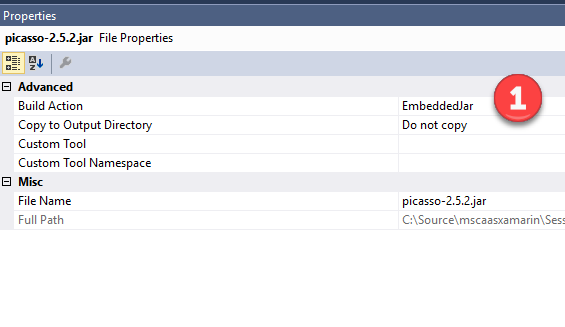

1.  Next thing we can see is a reference to the PicassoWrapper project from our Native Android project.

> 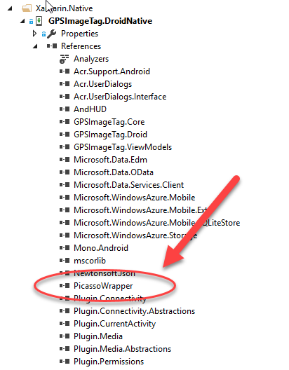

1.  Open the CustomerListAdapter.cs found under the Adapters folder in the GPSImageTag.DroidNative project (1). Point out the existing code that manages the downloading of our images using the Koush component (2).

> 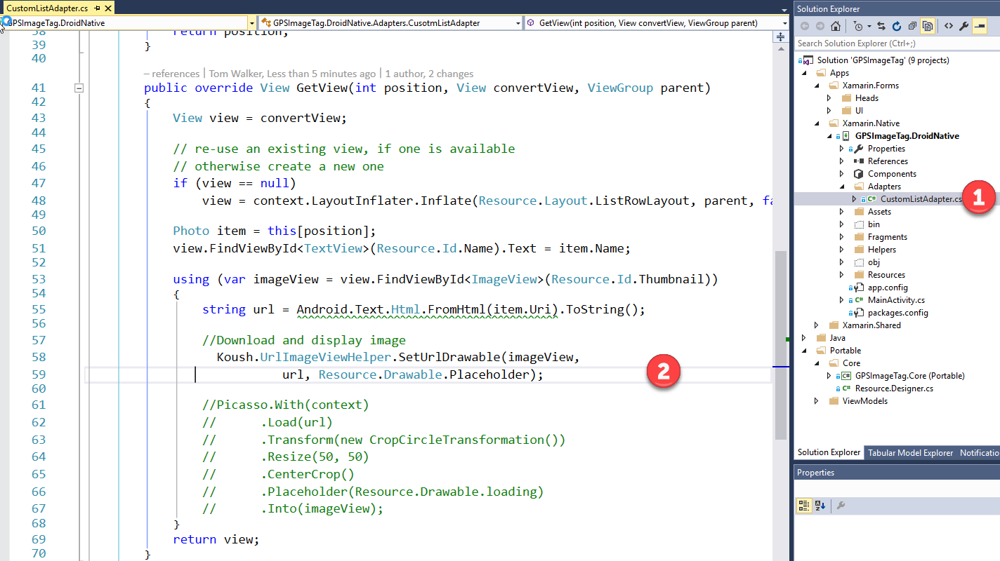

1.  Press F5 to run the Android Native client.

2.  Click on the Sync Photos button (1). We see the images are loaded normally as squares (2).

> 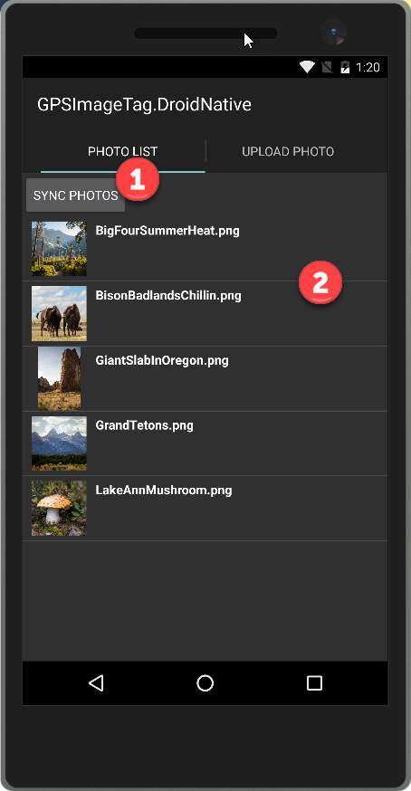

1.  Stop debugging.

2.  Go back to CustomListAdapter.cs

3.  Comment out the lines using the Koush.UrlImageviewHelper (1) and uncomment the lines for Picasso (2).

> 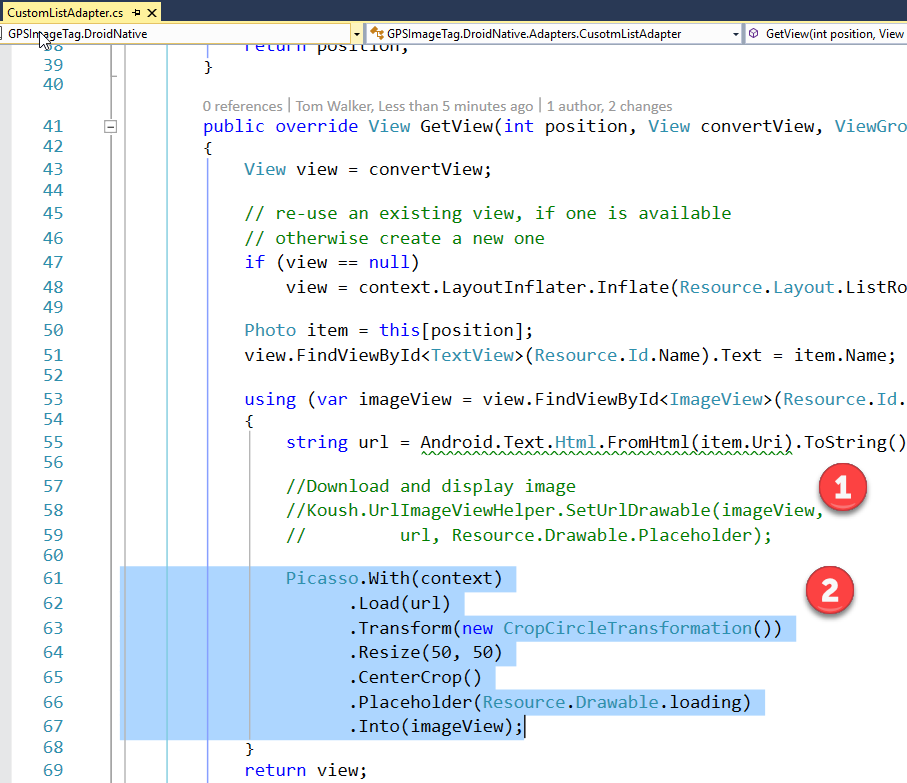

1.  Run the Android Native client again.

2.  Click on the Sync Photos button (1). We now see the images with a rounded look (2). Picasso also provides a placeholder and supports caching of the images.

> 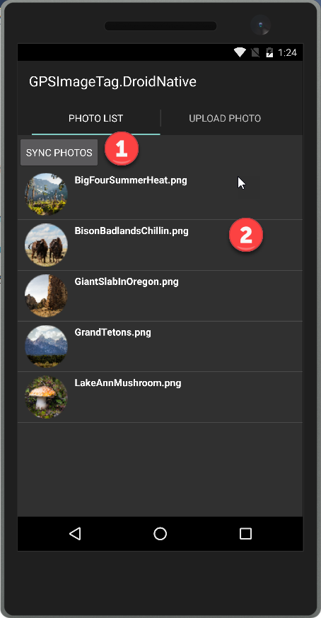

1.  To use the Picasso Java library within our Xamarin.***Forms*** Android project we need to setup a customer image render. Go to GPsImageTag.Droid head and PicassoImageRenderer.cs (1). The ExportRender Attribute has been defined for Images control. So when Xamarin.Forms is rendering an Image control in the Android project it will use this custom renderer (2). Within the custom renderer we are using the same Picasso Java library (3).

> 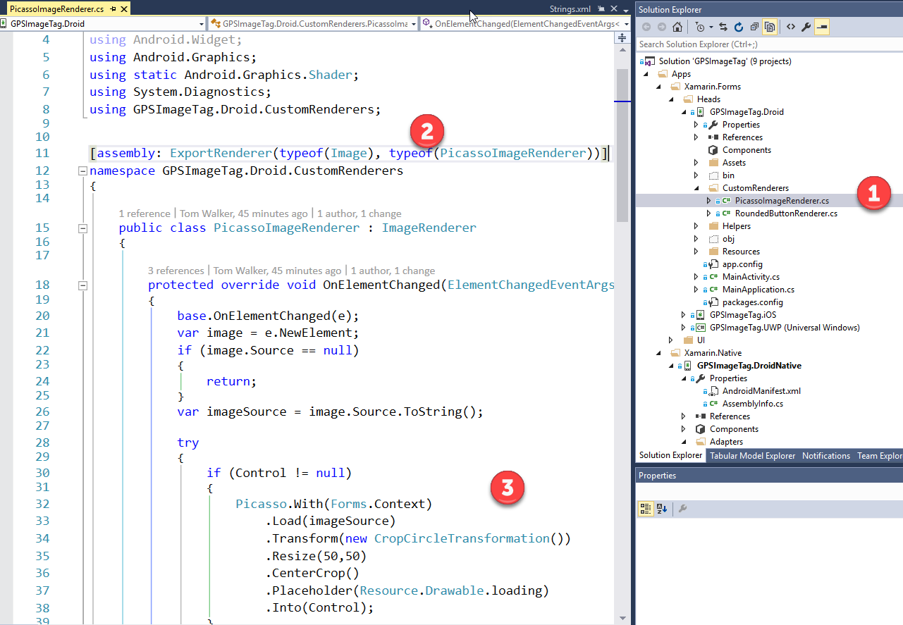

1.  In other platforms the Xamarin.Forms will render the Image control with the default control renderer. However, in Android it will use the custom renderer we’ve defined here. Note that the circle transform may not work in Xamarin forms.
