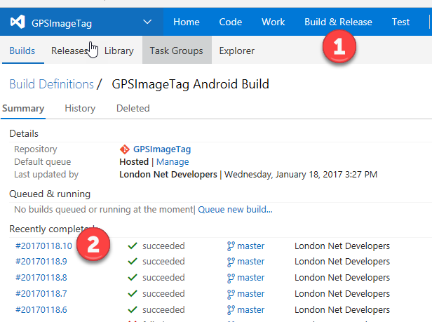
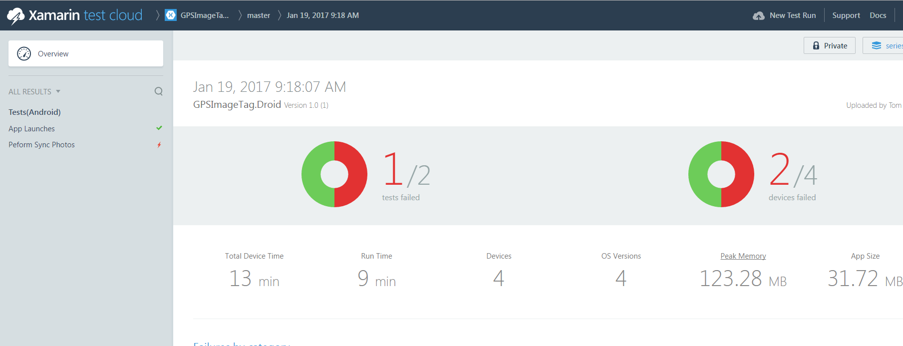
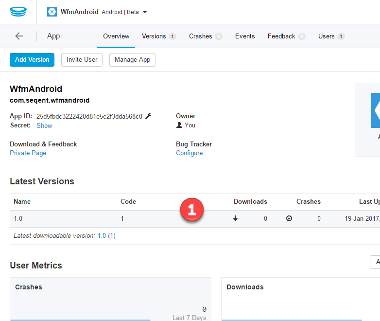
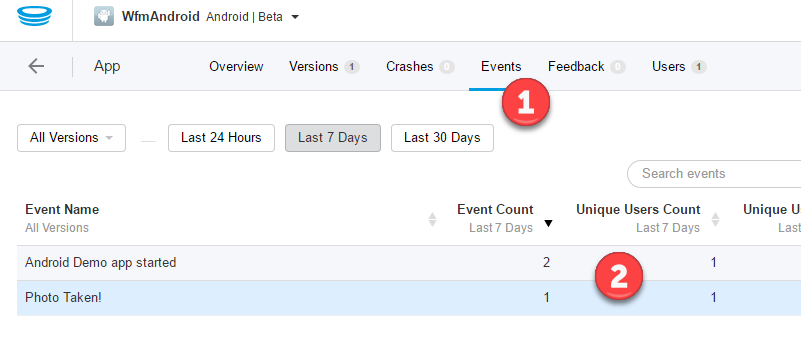

# Demo 3.6: Return to DevOPS

This demo should take about 3 minutes.

## Objectives

In this demo we will be wrapping up our discussion on DevOPS.

## \
Requirements

Internet connection is required in order to setup and run the demos.

Demo 3.4 setup.

## Setup

Make sure to complete the setup steps for Demo 3.4. That includes queuing and completing a successful build on VSTS. If you setup a Test Cloud account you will also have some test results to show. Hopefully you will be able to show another successful build during the session (kicked off at the start of Demo 3.4 and continuing while you get through Demo 3.5) completing before you get to this demo. If the build has not completed, you can fall back to the one you did at the end of the Demo 3.4 setup.

## Demo Steps

1.  Login back into the VSTS portal and click on the Build & Release (1) link. Show build complete with success (2).

> 

1.  If you setup a Test Cloud account in demo 3.4. Login back into the Xamarin Test Cloud portal. If we drill down into our team project for the GPSImageTag.Droid. We can see the results from deploying our tests to Xamarin Test Cloud from our VSTS build.

> 

1.  Logging back into the HockeyApp portal. We can view the releases that were deployed from our VSTS Build (1).

> 

1.  Clicking on the Events tab (1). We can see the customs events that were captured from our app (2).

> 

1.  Re-iterate how valuable it is to have the code in the cloud repository, a agile work item tracking system, continuous integration with unit tests, Xamarin Test Cloud tests, continuous deployment, release to Hockey app with notification to test users, and finally app monitoring with crash logging and event tracking. The provides a thorough DevOps cycle.
